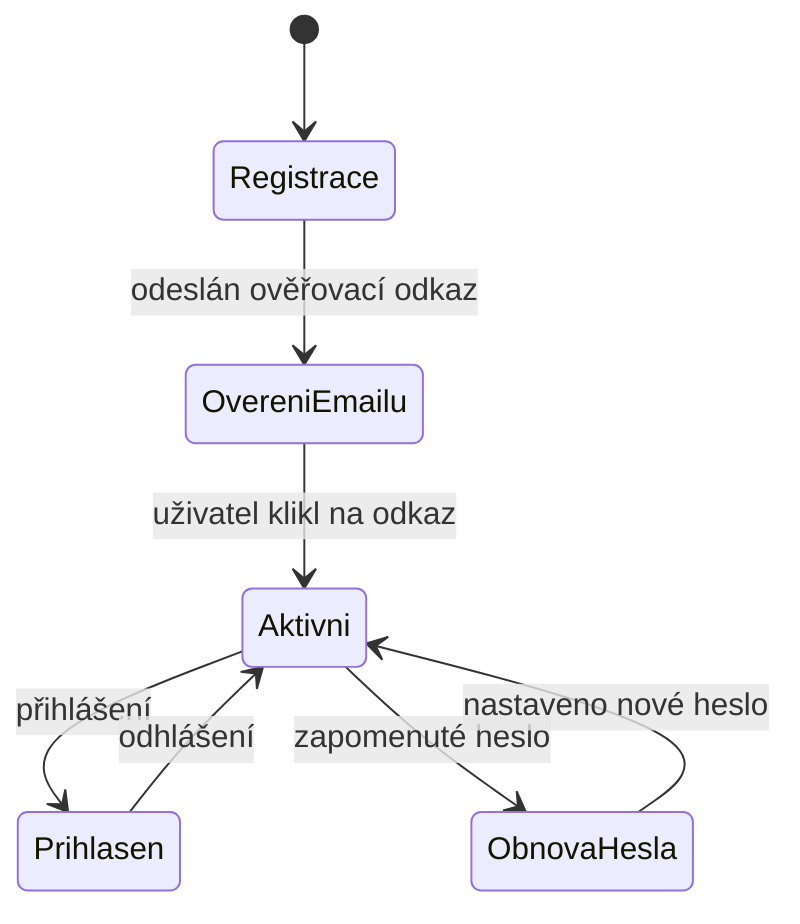

# Architektura a rozdělení repozitáře

Tento dokument popisuje, jak je celý projekt `fridrich.cloud` rozdělený na části,
jak spolu komunikují a kam co patří. Pravidla pro psaní kódu uvnitř jednotlivých
částí jsou v [`CLAUDE.md`](../CLAUDE.md).

---

## Obsah

1. [Principy rozdělení](#1-principy-rozdělení)
2. [Struktura repozitáře](#2-struktura-repozitáře)
3. [Domény a routing](#3-domény-a-routing)
4. [Backend – jedno API, více modulů](#4-backend--jedno-api-více-modulů)
5. [Identita, registrace a přihlášení](#5-identita-registrace-a-přihlášení)
6. [Sdílené balíčky](#6-sdílené-balíčky)
7. [Ukládání dat](#7-ukládání-dat)
8. [Lokální vývoj](#8-lokální-vývoj)
9. [Nasazení](#9-nasazení)
10. [Otevřené otázky](#otevřené-otázky)

---

## 1. Principy rozdělení

| Princip | Důsledek |
|---|---|
| **Portál je samostatná aplikace** | Prezentační web se buildí i nasazuje nezávisle na produktech. Výpadek nebo redesign IziWeddy se ho nedotkne. |
| **Každý produkt je samostatná aplikace** | IziWeddy a IziBudgy mají vlastní frontend, vlastní doménu, vlastní release. |
| **Jedna identita pro všechno** | Uživatel se registruje jednou na `fridrich.cloud` a tímtéž účtem se přihlásí do IziWeddy i IziBudgy. |
| **Jedno API, více modulů** | Backend je jedna Azure Functions aplikace rozdělená na moduly (`identity`, `weddy`, `budgy`) – ne tři samostatné Function Apps. |
| **Doména před infrastrukturou** | Doménové objekty jsou jádro, Functions handlery i Cosmos repozitáře jsou tenké adaptéry (viz `CLAUDE.md`). |

> **Proč jeden repozitář:** produkty sdílejí identitu, design tokeny i společné
> typy. Monorepo drží kontrakt na jednom místě a umožňuje atomickou změnu
> napříč frontendem i backendem.

---

## 2. Struktura repozitáře

Repozitář využívá **npm workspaces**.

```
fridrich.cloud/
├── apps/
│   ├── portal/                   # www.fridrich.cloud – prezentační web
│   │   ├── src/
│   │   │   ├── assets/           # obrázky, fonty, textury
│   │   │   ├── components/       # GlitchHeading, NeonPanel, HudFrame, …
│   │   │   ├── content/          # texty sekcí (o mně, služby, vývoj, projekty)
│   │   │   ├── router/
│   │   │   ├── sections/         # HeroSection, ServicesSection, …
│   │   │   ├── views/
│   │   │   └── main.ts
│   │   └── vite.config.ts
│   │
│   ├── iziweddy/                 # iziweddy.fridrich.cloud – svatební plánovač
│   │   └── src/                  # api/ components/ layouts/ router/ stores/ views/
│   │
│   ├── izibudgy/                 # izibudgy.fridrich.cloud – rozpočet domácnosti (TODO)
│   │
│   └── api/                      # api.fridrich.cloud – Azure Functions (TypeScript)
│       ├── src/
│       │   ├── domain/           # doménové objekty a porty (repository interfaces)
│       │   │   ├── identity/     # User, Credentials, Session, OneTimeToken, …
│       │   │   ├── weddy/        # Wedding, Guest, PlanningItem, Person
│       │   │   ├── contact/      # ContactMessage
│       │   │   └── shared/       # DomainError, Clock
│       │   ├── application/      # use-casy nad doménou
│       │   ├── infrastructure/
│       │   │   ├── cosmos/       # implementace repozitářů
│       │   │   ├── email/        # odesílatelé e-mailů
│       │   │   ├── crypto.ts     # Argon2id, generátory tokenů
│       │   │   └── container.ts  # složení závislostí
│       │   ├── http/             # odpovědi, cookies, obálky handlerů
│       │   ├── functions/        # HTTP triggery – tenké adaptéry
│       │   └── index.ts          # vstupní bod, načte triggery
│       ├── test/                 # testy nad paměťovými repozitáři
│       ├── host.json
│       └── local.settings.json   # NEcommitovat
│
├── packages/
│   ├── design/                   # struktura (primitives) + cyberpunkové téma portálu
│   ├── shared/                   # obecné typy a utility (API kontrakt, validace)
│   ├── weddy-shared/             # doménové typy IziWeddy sdílené s frontendem
│   └── budgy-shared/             # doménové typy IziBudgy (TODO)
│
├── doc/                          # dokumentace (tento adresář)
├── CLAUDE.md                     # pravidla pro psaní kódu
└── package.json                  # workspaces + skripty
```

### Co kam patří

| Kód | Umístění |
|---|---|
| Vzhled a texty prezentace | `apps/portal` |
| Obrazovky konkrétního produktu | `apps/<produkt>` |
| Business logika (jakákoli) | `apps/api/src/domain` + `application` |
| Práce s Cosmos DB | `apps/api/src/infrastructure/cosmos` |
| Typy, které vidí frontend i backend | `packages/*-shared` |
| Komponenta použitá ve dvou a více aplikacích | zatím nikde – vznikne `packages/ui`, až se první komponenta opravdu bude sdílet |
| Barvy, fonty, mřížka, efekty | `packages/design` |

---

## 3. Domény a routing

### Produkční domény

| Doména | Aplikace |
|---|---|
| `www.fridrich.cloud` | Portál (`fridrich.cloud` přesměrovává na `www`) |
| `iziweddy.fridrich.cloud` | IziWeddy |
| `izibudgy.fridrich.cloud` | IziBudgy |
| `api.fridrich.cloud` | Sdílené API |

> **Proč subdomény, a ne cesty (`/iziweddy`):** každá aplikace má vlastní build,
> vlastní nasazení a vlastní cache. Cesty by znamenaly jeden společný build a
> jeden společný release pro všechno.

### Routy portálu

| Routa | Obsah |
|---|---|
| `/` | Jednostránkový web s kotvami sekcí |
| `/#o-mne`, `/#sluzby`, `/#vyvoj`, `/#projekty`, `/#kontakt` | Sekce hlavní stránky |
| `/projekty/iziweddy` | Detail produktu IziWeddy + odkaz do aplikace |
| `/projekty/izibudgy` | Detail produktu IziBudgy |
| `/prihlaseni` | Přihlášení |
| `/registrace` | Registrace |
| `/ucet` | Profil uživatele a rozcestník do aplikací (po přihlášení) |

Detail routování produktů je v dokumentaci konkrétního produktu
(viz [iziweddy.md, kap. 6](iziweddy.md#6-obrazovky-a-navigace)).

---

## 4. Backend – jedno API, více modulů

Jedna Azure Functions aplikace, uvnitř rozdělená podle bounded contextů.
Prefixy oddělují moduly:

| Prefix | Modul | Popis |
|---|---|---|
| `/api/auth/*` | `identity` | Registrace, přihlášení, obnova hesla, profil |
| `/api/weddy/*` | `weddy` | Svatební plánovač |
| `/api/budgy/*` | `budgy` | Rozpočet domácnosti |

Moduly se **nevolají navzájem přímo**. Jediné, co sdílejí, je identita uživatele
předaná v tokenu (`userId`). Kdyby některý modul později vyrostl, jde ho z API
vyříznout bez zásahu do ostatních – proto má vlastní adresář v `domain/`
i vlastní kontejnery v databázi.

### Programovací model

Používá se **Azure Functions v4 (Node.js programming model v4)** – triggery se
registrují voláním `app.http()` v `src/functions/*.ts`, žádné soubory
`function.json`. Schéma adresářů v [`CLAUDE.md`](../CLAUDE.md) popisuje starší
model v3; závazná jsou tamní **pravidla 1–5**, ne rozložení souborů.

### CORS

API běží na jiné doméně než frontendy, takže musí povolit původy
`https://www.fridrich.cloud`, `https://iziweddy.fridrich.cloud`,
`https://izibudgy.fridrich.cloud` a `http://localhost:5173`–`5175` pro vývoj.
Seznam je v nastavení `ALLOWED_ORIGINS`.

Hlavičky CORS řeší **kód**, ne nastavení Function App: frontend posílá session
cookie (`credentials: 'include'`) a prohlížeč v takovém případě odmítne
odpověď s `Access-Control-Allow-Origin: *`. Musí se vracet konkrétní původ
a `Access-Control-Allow-Credentials: true`.

---

## 5. Identita, registrace a přihlášení

Registrace je součástí zadání – uživatel si zakládá **vlastní účet na
fridrich.cloud**, ne jen přihlášení přes cizího poskytovatele.

> ✅ **Rozhodnuto:** identitu si píšeme sami jako modul `identity` v našem API.
> Odmítnutou variantou bylo Microsoft Entra External ID – ušetřilo by práci
> s hesly, ale přihlašovací obrazovka by byla cizí a nešla by sladit
> s cyberpunkovým vzhledem portálu.
>
> **Co to znamená:** hesla, tokeny a rate limiting jsou naše odpovědnost.
> Pravidla níže proto nejsou doporučení, ale závazná část zadání.

### Doménový model (`apps/api/src/domain/identity`)

Podle [`CLAUDE.md`](../CLAUDE.md) nese logiku doménový objekt, ne DTO ani handler.

| Objekt | Odpovědnost |
|---|---|
| `User` | Agregát uživatele – e-mail, jméno, stav ověření. Metody `verifyEmail()`, `changeEmail()`, `rename()`. |
| `PasswordHash` | Hodnotový objekt. `PasswordHash.fromPlainText()` provede hash, `matches()` ověří heslo. Holý řetězec hesla se mimo tento objekt nedostane. |
| `EmailAddress` | Hodnotový objekt – normalizace na lowercase a kontrola formátu na jednom místě. |
| `OneTimeToken` | Jednorázový token pro ověření e-mailu i obnovu hesla. Zná svou expiraci a to, zda už byl použit. |
| `UserRepository` | Port – `findById`, `findByEmail`, `save`. Bez znalosti Cosmos SDK. |
| `TokenRepository` | Port pro jednorázové tokeny. |

Use-casy v `application/`: `RegisterUser`, `VerifyEmail`, `LoginUser`,
`RequestPasswordReset`, `ResetPassword`, `GetCurrentUser`.

### Model uživatele

```ts
export interface User {
  id: string;
  email: string;              // unikátní, uložený lowercase
  displayName: string;
  emailVerified: boolean;
  createdAt: string;
  updatedAt: string;
}
```

Heslo se **nikdy neukládá v modelu uživatele**, který cestuje na frontend.
Hash žije v samostatném dokumentu / poli, které repozitář nikdy nevrací ven.

### Toky



### Endpointy modulu `identity`

| Metoda | Endpoint | Odpověď |
|---|---|---|
| `POST` | `/api/auth/register` | `202` – vždy stejná, i pro obsazený e-mail |
| `POST` | `/api/auth/login` | `200` + uživatel, nastaví session cookie |
| `POST` | `/api/auth/logout` | `204`, smaže cookie |
| `GET` | `/api/auth/me` | `200` + uživatel, `401` bez přihlášení |
| `POST` | `/api/auth/verify-email` | `200` + uživatel |
| `POST` | `/api/auth/forgot-password` | `202` – vždy stejná, i pro neznámou adresu |
| `POST` | `/api/auth/reset-password` | `204`, odhlásí všechna zařízení |

Endpointy modulu weddy jsou v [iziweddy.md, kap. 7](iziweddy.md#7-rest-api),
plus veřejný `POST /api/contact` pro formulář z portálu.

### Bezpečnostní pravidla

- Heslo hashovat **Argon2id** (fallback bcrypt), nikdy ne rychlou hashovací funkcí.
- Minimální délka hesla **12 znaků**, kontrola proti seznamu prolomených hesel.
- Session token v **httpOnly + Secure + SameSite=Lax cookie** na doméně
  `.fridrich.cloud`, aby platila i na subdoménách produktů.
- Odpověď na `/login` i `/forgot-password` **nesmí prozradit**, zda e-mail existuje.
- Rate limiting na `/register`, `/login` a `/forgot-password`.
- Adresa klienta se bere z `x-azure-clientip` (platforma ji přepisuje), jinak
  z **poslední** položky `x-forwarded-for`. První položku si posílá klient sám –
  kdyby se použila, stačilo by ji obměňovat a limity by přestaly platit.
- Ověřovací a resetovací tokeny: jednorázové, s expirací (24 h / 1 h).
- Session cookie nese **neuhodnutelný náhodný identifikátor session**, ne data
  o uživateli. Session se dá kdykoli zneplatnit na serveru (odhlášení na všech
  zařízeních, změna hesla).
- Ověření session probíhá **v jednom sdíleném middleware**, ne v každém
  handleru zvlášť – aby nešlo omylem publikovat nechráněný endpoint.
- Do logu se nikdy nedostane heslo, token ani obsah cookie.

### Kontaktní formulář

Endpoint `POST /api/contact` je jediný **veřejný** (nepřihlášený) zápisový
endpoint. Proto má vlastní ochranu: honeypot pole, rate limiting podle IP
a délkové limity na všechna pole.

---

## 6. Sdílené balíčky

| Balíček | Obsah | Kdo používá |
|---|---|---|
| `@fridrich/design` | Struktura (`primitives.css` – rozestupy, pohyb, reset) a cyberpunkové téma portálu. Produkty berou jen strukturu a dodávají vlastní paletu. | portal, iziweddy, izibudgy |
| `@fridrich/shared` | Kontrakt API (typy odpovědí a chyb), validační pomocníci, typ `User` | všechny + api |
| `@fridrich/weddy-shared` | Typy a výčty svatebního plánovače | iziweddy + api |
| `@fridrich/budgy-shared` | Typy rozpočtu domácnosti | izibudgy + api |

**Pravidlo:** balíček `*-shared` obsahuje jen datové typy a čistou validaci /
výpočty – žádné volání databáze a žádné komponenty. Doménové objekty s chováním
žijí v `apps/api/src/domain`; sdílené balíčky nesou jen tvar dat, který přechází
po drátě.

---

## 7. Ukládání dat

Azure Cosmos DB (NoSQL API), účet `lf-page-db`, databáze **`izi-db`**,
kontejnery po bounded contextech:

| Kontejner | Partition key | Modul |
|---|---|---|
| `users` | `/id` | identity |
| `credentials` | `/userId` | identity |
| `tokens` | `/userId` | identity – TTL 30 dní |
| `sessions` | `/userId` | identity – TTL 60 dní |
| `rateLimits` | `/id` | sdílené – TTL 24 hodin |
| `contactMessages` | `/id` | kontaktní formulář |
| `weddings` | `/id` | weddy |
| `guests` | `/weddingId` | weddy |
| `planningItems` | `/weddingId` | weddy |
| *(TODO)* | | budgy |

Kontejnery i databáze vznikají samy při prvním startu (`createIfNotExists`),
takže nasazení nepotřebuje ruční přípravu schématu. Dočasné záznamy
(tokeny, sessions, počítadla limitů) mají nastavené **TTL** – Cosmos DB je
maže sám, není potřeba úklidová úloha.

### Kapacita (RU/s)

Účet **není serverless**, ale s předplacenou kapacitou, a má nastavený strop
**400 RU/s na celý účet**. To má dva důsledky, o které se dá snadno zaříznout:

1. **Kapacita se drží na databázi, ne na kontejnerech.** Kontejner bez
   vlastního nastavení dostane minimálně 400 RU/s sám pro sebe – devět
   kontejnerů by si řeklo o 3600 RU/s a vytvoření by skončilo chybou.
   Databáze se sdílenou kapacitou je rozdělí mezi sebe (limit 25 kontejnerů).
   Řídí to `COSMOS_THROUGHPUT`; na serverless účtu se nechá **prázdné**,
   protože ten throughput odmítá.
2. **Nová databáze se do stropu nevejde.** Proto produkty nemají vlastní
   databázi, ale sdílí `izi-db`, která už 400 RU/s alokovaných má.

> ⚠️ **Vývoj i produkce jedou proti stejné databázi.** Vědomé rozhodnutí –
> testovací účty a data z lokálního vývoje končí tam, co ostrá data.
> Až provoz poroste, oddělit prostředí znamená zvýšit strop účtu
> (*Azure Portal → účet → Settings → Cost Management → Limit total account
> throughput*) a založit druhou databázi.

> ℹ️ V `izi-db` zůstávají kontejnery `Seats`, `Users` a `AuthSessions`
> z předchozí aplikace. Pozor na `Users` vs. náš `users` – Cosmos DB rozlišuje
> velikost písmen, takže vedle sebe žijí dva různé kontejnery. Až staré
> struktury půjdou pryč, tahle past zmizí s nimi.

Partition key se volí podle dominantního dotazu daného agregátu – u hostů a
položek je to vždy „vše pro jednu svatbu", proto `/weddingId`.

---

## 8. Lokální vývoj

### Požadavky

- Node.js 20 LTS nebo novější
- Azure Functions Core Tools v4
- Azure Cosmos DB Emulator (nebo připojení ke vzdálené Cosmos DB)

### Porty

| Aplikace | Port |
|---|---|
| Portál | `5173` |
| IziWeddy | `5174` |
| IziBudgy | `5175` |
| API | `7071` |

### Skripty v kořenovém `package.json`

```json
{
  "scripts": {
    "dev:portal": "npm run dev -w apps/portal",
    "dev:api": "npm run start -w apps/api",
    "build": "npm run build --workspaces --if-present",
    "test": "npm run test --workspaces --if-present"
  }
}
```

### Nastavení API

Zkopírujte `apps/api/local.settings.json.example` na `local.settings.json`
a doplňte klíč k databázi. Bez `ACS_CONNECTION_STRING` se e-maily mimo
produkci **vypisují do konzole** – ověřovací odkaz se dá zkopírovat z výpisu
`func start`, není potřeba nastavovat poštovní službu. V produkci chybějící
připojovací řetězec vyhodí chybu, aby se odkazy netiše neztrácely v logu.

> ⚠️ **Při vývoji snadno narazíte na rate limit.** Lokálně nestojí před API
> žádná proxy, takže hlavičky s adresou klienta chybí a všechny požadavky
> spadnou do jednoho koše pod klíčem `unknown`. Platí tedy 5 registrací za
> hodinu a 20 přihlášení za 15 minut **dohromady**, ne na uživatele.
> Odpověď `429` proto při zkoušení obvykle neznamená chybu v kódu.
> Řešení: počkat, smazat obsah kontejneru `rateLimits`, nebo požadavkům
> posílat hlavičku `x-forwarded-for` s různou adresou.

Frontendy mají ve `vite.config.ts` proxy `/api` → `http://localhost:7071`, takže
při vývoji nevzniká cross-origin požadavek.

---

## 9. Nasazení

| Část | Služba |
|---|---|
| Portál, IziWeddy, IziBudgy | Azure Static Web Apps (jedna instance na aplikaci) |
| API | Azure Functions (Flex Consumption), vlastní doména `api.fridrich.cloud` |
| Databáze | Azure Cosmos DB serverless |

- Nasazení přes **GitHub Actions**; každý workflow má `paths:` filtr, aby se
  změna v portálu nebuildila IziWeddy a naopak.
- Pull request vytvoří preview prostředí pro dotčenou aplikaci.
- Tajemství (Cosmos klíč, podpisový klíč tokenů, SMTP) v *Application settings*,
  ideálně přes Key Vault referenci.

Každý frontend potřebuje `staticwebapp.config.json` s `navigationFallback`, aby
fungovalo přímé otevření URL při routeru v režimu history.

---

## Otevřené otázky

| # | Otázka | Varianty | Návrh |
|---|---|---|---|
| 1 | Posílání e-mailů (ověření, obnova hesla)? | Azure Communication Services / Resend / SendGrid | Azure Communication Services – zůstane vše v Azure |
| 2 | Mají být produkty placené? | zdarma / předplatné | Zatím zdarma, model předplatného neřešit |
| 3 | Instalace na plochu (PWA)? | ano / ne | Ano u produktů (IziWeddy, IziBudgy), u portálu ne |
| 4 | Vícejazyčnost? | jen čeština / cs + en | Zatím jen čeština, texty ale držet v `content/`, ať jde jazyk doplnit |

## Zodpovězeno

| Otázka | Rozhodnutí |
|---|---|
| Jak řešit identitu? | **Vlastní modul `identity` v našem API** – viz [kap. 5](#5-identita-registrace-a-přihlášení). |
| Reference na portálu | Zatím se neřeší. |
| Menu portálu | *O mně · Služby · Vývoj · Projekty · Kontakt · Přihlásit se* – *Vývoj* je popis postupu spolupráce. |
