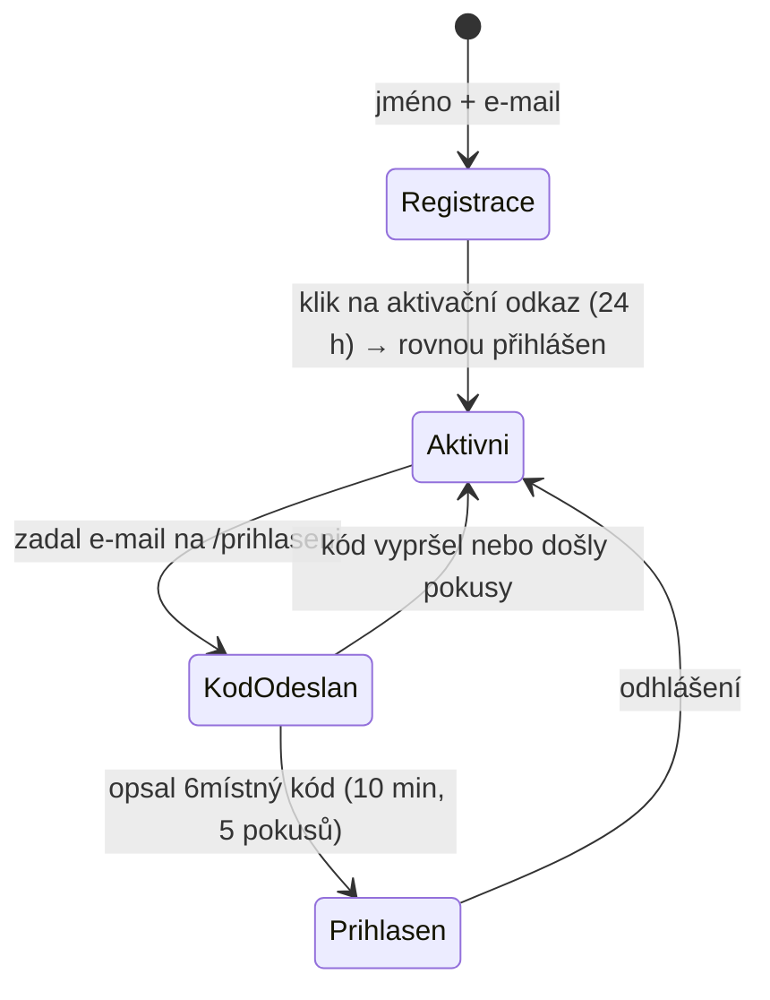

# Architektura a rozdělení repozitáře

Tento dokument popisuje, jak je celý projekt `fridrich.cloud` rozdělený na části,
jak spolu komunikují a kam co patří. Pravidla pro psaní kódu uvnitř jednotlivých
částí jsou v [`CLAUDE.md`](../CLAUDE.md).

---

## Obsah

1. [Principy rozdělení](#1-principy-rozdělení)
2. [Struktura repozitáře](#2-struktura-repozitáře)
3. [Adresy a routing](#3-adresy-a-routing)
4. [Backend – jedno API, více modulů](#4-backend--jedno-api-více-modulů)
5. [Identita, registrace a přihlášení](#5-identita-registrace-a-přihlášení)
6. [Sdílené balíčky](#6-sdílené-balíčky)
7. [Ukládání dat](#7-ukládání-dat)
8. [Lokální vývoj](#8-lokální-vývoj)
9. [Nasazení](#9-nasazení)
10. [Otevřené otázky](#otevřené-otázky)

---

## 1. Principy rozdělení

| Princip | Důsledek |
|---|---|
| **Portál je samostatná aplikace** | Prezentační web se buildí i nasazuje nezávisle na produktech. Výpadek nebo redesign IziWeddy se ho nedotkne. |
| **Každý produkt je samostatná aplikace** | IziWeddy a IziBudgy mají vlastní frontend, vlastní build, vlastní release. |
| **Jedna doména, cesty místo subdomén** | Všechno visí pod `www.fridrich.cloud` – portál na `/`, produkty na `/izi-weddy` a `/izi-budgy`, API na `/api`. Jeden origin znamená žádné CORS a cookie bez triku se subdoménami. |
| **Jedna identita pro všechno** | Uživatel se registruje jednou na `fridrich.cloud` a tímtéž účtem se přihlásí do IziWeddy i IziBudgy. |
| **Jedno API, více modulů** | Backend je jedna Azure Functions aplikace rozdělená na moduly (`identity`, `weddy`, `budgy`) – ne tři samostatné Function Apps. |
| **Doména před infrastrukturou** | Doménové objekty jsou jádro, Functions handlery i Cosmos repozitáře jsou tenké adaptéry (viz `CLAUDE.md`). |

> **Proč jeden repozitář:** produkty sdílejí identitu, design tokeny i společné
> typy. Monorepo drží kontrakt na jednom místě a umožňuje atomickou změnu
> napříč frontendem i backendem.

---

## 2. Struktura repozitáře

Repozitář využívá **npm workspaces**.

```
fridrich.cloud/
├── apps/
│   ├── portal/                   # www.fridrich.cloud/ – prezentační web
│   │   ├── src/
│   │   │   ├── assets/           # obrázky, fonty, textury
│   │   │   ├── components/       # GlitchHeading, NeonPanel, HudFrame, …
│   │   │   ├── content/          # texty sekcí (o mně, služby, vývoj, projekty)
│   │   │   ├── router/
│   │   │   ├── sections/         # HeroSection, ServicesSection, …
│   │   │   ├── views/
│   │   │   └── main.ts
│   │   └── vite.config.ts
│   │
│   ├── iziweddy/                 # /izi-weddy – svatební plánovač
│   │   └── src/                  # api/ components/ layouts/ router/ stores/ views/
│   │
│   ├── izibudgy/                 # /izi-budgy – rozpočet domácnosti (TODO)
│   │
│   └── api/                      # /api – Azure Functions (TypeScript)
│       ├── src/
│       │   ├── domain/           # doménové objekty a porty (repository interfaces)
│       │   │   ├── identity/     # User, Credentials, Session, OneTimeToken, …
│       │   │   ├── weddy/        # Wedding, Guest, PlanningItem, Person
│       │   │   ├── contact/      # ContactMessage
│       │   │   └── shared/       # DomainError, Clock
│       │   ├── application/      # use-casy nad doménou
│       │   ├── infrastructure/
│       │   │   ├── cosmos/       # implementace repozitářů
│       │   │   ├── email/        # odesílatelé e-mailů
│       │   │   ├── crypto.ts     # generátory tokenů a kódů
│       │   │   └── container.ts  # složení závislostí
│       │   ├── http/             # odpovědi, cookies, obálky handlerů
│       │   ├── functions/        # HTTP triggery – tenké adaptéry
│       │   └── index.ts          # vstupní bod, načte triggery
│       ├── test/                 # testy nad paměťovými repozitáři
│       ├── host.json
│       └── local.settings.json   # NEcommitovat
│
├── packages/
│   ├── design/                   # struktura (primitives) + cyberpunkové téma portálu
│   ├── shared/                   # obecné typy a utility (API kontrakt, validace)
│   ├── weddy-shared/             # doménové typy IziWeddy sdílené s frontendem
│   └── budgy-shared/             # doménové typy IziBudgy (TODO)
│
├── doc/                          # dokumentace (tento adresář)
├── CLAUDE.md                     # pravidla pro psaní kódu
└── package.json                  # workspaces + skripty
```

### Co kam patří

| Kód | Umístění |
|---|---|
| Vzhled a texty prezentace | `apps/portal` |
| Obrazovky konkrétního produktu | `apps/<produkt>` |
| Business logika (jakákoli) | `apps/api/src/domain` + `application` |
| Práce s Cosmos DB | `apps/api/src/infrastructure/cosmos` |
| Typy, které vidí frontend i backend | `packages/*-shared` |
| Komponenta použitá ve dvou a více aplikacích | zatím nikde – vznikne `packages/ui`, až se první komponenta opravdu bude sdílet |
| Barvy, fonty, mřížka, efekty | `packages/design` |

---

## 3. Adresy a routing

### Produkční adresy

Všechno běží na **jedné doméně** `www.fridrich.cloud` (`fridrich.cloud`
přesměrovává na `www`). Části se rozlišují cestou:

| Cesta | Aplikace |
|---|---|
| `/` | Portál |
| `/izi-weddy/*` | IziWeddy |
| `/izi-budgy/*` | IziBudgy |
| `/api/*` | Sdílené API |

> **Proč cesty, a ne subdomény:** všechno je na jednom originu, takže odpadá
> CORS i session cookie roztažená přes `Domain=.fridrich.cloud`. Prohlížeč vidí
> jeden web, ne čtyři – jeden certifikát, jeden DNS záznam, jedno nastavení.
>
> **Samostatnost se tím neztrácí.** Každá aplikace má pořád vlastní `package.json`,
> vlastní build a vlastní workflow; při nasazení se jen její `dist` zkopíruje do
> podadresáře výsledného webu. Release IziWeddy se portálu nedotkne.
>
> **Co si to vybírá:** aplikace musí vědět, pod jakou cestou běží. Řeší to
> `base` ve `vite.config.ts` a `createWebHistory(import.meta.env.BASE_URL)`
> v routeru – nikde v kódu nesmí být natvrdo napsaný prefix.

### Routy portálu

| Routa | Obsah |
|---|---|
| `/` | Jednostránkový web s kotvami sekcí |
| `/#o-mne`, `/#sluzby`, `/#vyvoj`, `/#projekty`, `/#kontakt` | Sekce hlavní stránky |
| `/projekty/iziweddy` | Detail produktu IziWeddy + odkaz do aplikace |
| `/projekty/izibudgy` | Detail produktu IziBudgy |
| `/prihlaseni` | Přihlášení – dvoukrokové, e-mail a pak kód |
| `/registrace` | Registrace – jméno a e-mail |
| `/overeni-emailu` | Aktivace účtu z odkazu v e-mailu |
| `/ucet` | Profil uživatele a rozcestník do aplikací (po přihlášení) |

Router portálu obsluhuje jen kořen webu. Cesty `/izi-weddy/*`, `/izi-budgy/*`
a `/api/*` patří jiným aplikacím – portál na ně proto nikdy nenaviguje přes
`router.push()`, ale celou stránkou (`window.location`).

Detail routování produktů je v dokumentaci konkrétního produktu
(viz [iziweddy.md, kap. 6](iziweddy.md#6-obrazovky-a-navigace)).

---

## 4. Backend – jedno API, více modulů

Jedna Azure Functions aplikace, uvnitř rozdělená podle bounded contextů.
Prefixy oddělují moduly:

| Prefix | Modul | Popis |
|---|---|---|
| `/api/auth/*` | `identity` | Registrace, přihlášení kódem, profil |
| `/api/weddy/*` | `weddy` | Svatební plánovač |
| `/api/budgy/*` | `budgy` | Rozpočet domácnosti |

Moduly se **nevolají navzájem přímo**. Jediné, co sdílejí, je identita uživatele
předaná v tokenu (`userId`). Kdyby některý modul později vyrostl, jde ho z API
vyříznout bez zásahu do ostatních – proto má vlastní adresář v `domain/`
i vlastní kontejnery v databázi.

### Programovací model

Používá se **Azure Functions v4 (Node.js programming model v4)** – triggery se
registrují voláním `app.http()` v `src/functions/*.ts`, žádné soubory
`function.json`. Schéma adresářů v [`CLAUDE.md`](../CLAUDE.md) popisuje starší
model v3; závazná jsou tamní **pravidla 1–5**, ne rozložení souborů.

### CORS

**V produkci žádné CORS nevzniká.** API visí na `www.fridrich.cloud/api`, tedy
na stejném originu jako portál i produkty – požadavek je same-origin a prohlížeč
se na preflight ani neptá. To byl hlavní důvod přechodu z subdomén na cesty.

Kontrola původu ale ze systému nemizí, jen se zjednodušuje:

- `ALLOWED_ORIGINS` obsahuje v produkci jediný záznam `https://www.fridrich.cloud`
  a při vývoji `http://localhost:5173`–`5175`, protože Vite dev server běží na
  vlastním portu a proxy `/api` posílá dál na `http://localhost:7071`.
- Hlavičky CORS řeší **kód**, ne nastavení Function App: kdyby se někdy
  objevil cizí původ (preview prostředí, mobilní klient), musí se vracet
  konkrétní původ a `Access-Control-Allow-Credentials: true`. Se session cookie
  (`credentials: 'include'`) prohlížeč odpověď s `Access-Control-Allow-Origin: *`
  odmítne.

---

## 5. Identita, registrace a přihlášení

Registrace je součástí zadání – uživatel si zakládá **vlastní účet na
fridrich.cloud**, ne jen přihlášení přes cizího poskytovatele.

> ✅ **Rozhodnuto:** identitu si píšeme sami jako modul `identity` v našem API.
> Odmítnutou variantou bylo Microsoft Entra External ID – přihlašovací
> obrazovka by byla cizí a nešla by sladit s cyberpunkovým vzhledem portálu.

> ✅ **Rozhodnuto: systém je bezheslový.** Uživatel si žádné heslo nevolí ani
> nezadává – totožnost prokazuje tím, že se dostane do své e-mailové schránky.
>
> **Proč:** heslo je u aplikace tohohle typu jen nevýhoda. Uživatel si ho
> stejně nepamatuje a skončí u „zapomenuté heslo" – tedy u e-mailu, na kterém
> celá obnova beztak visí. Bez hesel odpadá hashování, politika síly, seznam
> prolomených hesel i kanál, kterým se dá heslo z jiného webu vyzkoušet tady
> (credential stuffing). Nemáme co ukrást.
>
> **Co si to vybírá:** bezpečnost účtu je přesně tak silná jako bezpečnost
> schránky, a přihlášení potřebuje doručený e-mail. Výpadek pošty tedy znamená
> výpadek přihlašování – proto se e-maily posílají přes Azure Communication
> Services a ne přes vlastní SMTP.

### Dvě cesty dovnitř



**Registrace** chce jen jméno a e-mail. Na adresu přijde aktivační odkaz;
jeho otevřením se účet ověří a uživatel je rovnou přihlášený – nutit ho hned
nato ještě o kód by nic nepřidalo, odkaz ze schránky je stejný důkaz.

**Přihlášení je dvoukrokové.** Nejdřív uživatel zadá e-mail, pak opíše
šestimístný kód, který mu na něj přišel. Úspěšné přihlášení zároveň ověří
e-mail, takže účet jde aktivovat i bez kliknutí na odkaz z registrace.

### Doménový model (`apps/api/src/domain/identity`)

Podle [`CLAUDE.md`](../CLAUDE.md) nese logiku doménový objekt, ne DTO ani handler.

| Objekt | Odpovědnost |
|---|---|
| `User` | Agregát uživatele – e-mail, jméno, stav ověření. Metody `verifyEmail()`, `changeEmail()`, `rename()`. |
| `EmailAddress` | Hodnotový objekt – normalizace na lowercase a kontrola formátu na jednom místě. |
| `OneTimeToken` | Jednorázový token z aktivačního odkazu. Zná svou expiraci a to, zda už byl použit. |
| `LoginCode` | Přihlašovací výzva – šestimístný kód. Drží krátkou platnost, počítadlo pokusů a jednorázovost; jediná cesta dovnitř vede přes `verify()`. |
| `Session` | Přihlášení. Posouvá si platnost při aktivitě, ale nejvýš jednou denně, ať nekrmí databázi zápisy. |
| `UserRepository` | Port – `findById`, `findByEmail`, `save`. Bez znalosti Cosmos SDK. |
| `TokenRepository`, `LoginCodeRepository`, `SessionRepository` | Porty pro zbylé tři agregáty. |
| `TokenGenerator` | Port – náhodné tokeny, šestimístné kódy a porovnání otisku. Doména neví, co je pod tím. |

Use-casy v `application/`: `registerUser`, `verifyEmail`, `requestLoginCode`,
`verifyLoginCode`, `resolveSession`, `logout`.

### Model uživatele

```ts
export interface User {
  id: string;
  email: string;              // unikátní, uložený lowercase
  displayName: string;
  emailVerified: boolean;
  createdAt: string;
  updatedAt: string;
}
```

Tenhle tvar jde po drátě na frontend, takže neobsahuje nic z bezpečnostní
vrstvy. Tokeny, kódy ani session v něm nemají co dělat – žijí ve vlastních
kontejnerech a repozitáře je ven nevracejí.

### Endpointy modulu `identity`

| Metoda | Endpoint | Odpověď |
|---|---|---|
| `POST` | `/api/auth/register` | `202` – vždy stejná, i pro obsazený e-mail |
| `POST` | `/api/auth/verify-email` | `200` + uživatel, nastaví session cookie |
| `POST` | `/api/auth/login` | `202` – vždy stejná, i pro neznámou adresu; pošle kód |
| `POST` | `/api/auth/login/verify` | `200` + uživatel, nastaví session cookie |
| `POST` | `/api/auth/logout` | `204`, smaže cookie |
| `GET` | `/api/auth/me` | `200` + uživatel, `401` bez přihlášení |

Endpointy modulu weddy jsou v [iziweddy.md, kap. 7](iziweddy.md#7-rest-api),
plus veřejný `POST /api/contact` pro formulář z portálu.

### Bezpečnostní pravidla

- **Přihlašovací kód platí 10 minut a přežije 5 chybných pokusů.** Šest číslic
  je milion možností – délka kódu tedy není obranou, tou je krátké okno a
  počítadlo. Obojí hlídá `LoginCode`, ne volající.
- **Kód se vydá vždy nový.** Vyžádání dalšího zahodí ten předchozí, ať nemá
  uživatel ve schránce dva platné.
- **Kód nechodí jako odkaz, jen jako číslo k opsání.** Odkaz v e-mailu
  otevírají skenery pošty a náhledy zpráv – u aktivace to nevadí (je
  jednorázová a chce ji sám uživatel), u přihlášení by to znamenalo, že cizí
  služba proklikne přihlášení za něj.
- **V databázi leží jen otisk.** U tokenů stačí SHA-256 – 32 náhodných bajtů
  se uhodnout nedá. U šestimístného kódu by se otisk dopočítal hrubou silou
  během chvilky, proto se hashuje spolu s `id` výzvy; skutečnou obranou
  zůstává krátká platnost a počítadlo pokusů.
- **Odpověď na `/register` ani `/login` neprozradí, zda e-mail existuje.**
  Rozdíl je jen v tom, co přijde do schránky – a to vidí jenom její majitel.
- Rate limiting na `/register`, `/login` i `/login/verify`. Limit na
  `/login` je i **podle adresy**, ne jen podle IP: jinak by se přes formulář
  dala cizí schránka zasypat kódy.
- Adresa klienta se bere z `x-azure-clientip` (platforma ji přepisuje), jinak
  z **poslední** položky `x-forwarded-for`. První položku si posílá klient sám –
  kdyby se použila, stačilo by ji obměňovat a limity by přestaly platit.
- Aktivační token: jednorázový, s expirací 24 hodin.
- Session token v **httpOnly + Secure + SameSite=Lax cookie** s `Path=/`
  na `www.fridrich.cloud`. Protože portál, produkty i API sdílejí jeden origin,
  cookie platí všude sama od sebe – `Domain=.fridrich.cloud` (nastavení
  `COOKIE_DOMAIN`) už není potřeba a nechává se prázdné, ať se cookie
  zbytečně nerozlévá na cizí subdomény.
- Session cookie nese **neuhodnutelný náhodný identifikátor session**, ne data
  o uživateli. Session se dá kdykoli zneplatnit na serveru (odhlášení,
  odhlášení na všech zařízeních).
- Ověření session probíhá **v jednom sdíleném middleware**, ne v každém
  handleru zvlášť – aby nešlo omylem publikovat nechráněný endpoint.
- Do logu se nikdy nedostane token, kód ani obsah cookie.

### Kontaktní formulář

Endpoint `POST /api/contact` je jediný **veřejný** (nepřihlášený) zápisový
endpoint. Proto má vlastní ochranu: honeypot pole, rate limiting podle IP
a délkové limity na všechna pole.

---

## 6. Sdílené balíčky

| Balíček | Obsah | Kdo používá |
|---|---|---|
| `@fridrich/design` | Struktura (`primitives.css` – rozestupy, pohyb, reset) a cyberpunkové téma portálu. Produkty berou jen strukturu a dodávají vlastní paletu. | portal, iziweddy, izibudgy |
| `@fridrich/shared` | Kontrakt API (typy odpovědí a chyb), validační pomocníci, typ `User` | všechny + api |
| `@fridrich/weddy-shared` | Typy a výčty svatebního plánovače | iziweddy + api |
| `@fridrich/budgy-shared` | Typy rozpočtu domácnosti | izibudgy + api |

**Pravidlo:** balíček `*-shared` obsahuje jen datové typy a čistou validaci /
výpočty – žádné volání databáze a žádné komponenty. Doménové objekty s chováním
žijí v `apps/api/src/domain`; sdílené balíčky nesou jen tvar dat, který přechází
po drátě.

---

## 7. Ukládání dat

Azure Cosmos DB (NoSQL API), účet `lf-page-db`, databáze **`izi-db`**,
kontejnery po bounded contextech:

| Kontejner | Partition key | Modul |
|---|---|---|
| `users` | `/id` | identity |
| `tokens` | `/userId` | identity – aktivační odkazy, TTL 30 dní |
| `loginCodes` | `/userId` | identity – přihlašovací kódy, TTL 1 hodina |
| `sessions` | `/userId` | identity – TTL 60 dní |
| `rateLimits` | `/id` | sdílené – TTL 24 hodin |
| `contactMessages` | `/id` | kontaktní formulář |
| `weddings` | `/id` | weddy |
| `guests` | `/weddingId` | weddy |
| `planningItems` | `/weddingId` | weddy |
| *(TODO)* | | budgy |

Kontejnery i databáze vznikají samy při prvním startu (`createIfNotExists`),
takže nasazení nepotřebuje ruční přípravu schématu. Dočasné záznamy
(tokeny, sessions, počítadla limitů) mají nastavené **TTL** – Cosmos DB je
maže sám, není potřeba úklidová úloha.

### Kapacita (RU/s)

Účet **není serverless**, ale s předplacenou kapacitou, a má nastavený strop
**400 RU/s na celý účet**. To má dva důsledky, o které se dá snadno zaříznout:

1. **Kapacita se drží na databázi, ne na kontejnerech.** Kontejner bez
   vlastního nastavení dostane minimálně 400 RU/s sám pro sebe – devět
   kontejnerů by si řeklo o 3600 RU/s a vytvoření by skončilo chybou.
   Databáze se sdílenou kapacitou je rozdělí mezi sebe (limit 25 kontejnerů).
   Řídí to `COSMOS_THROUGHPUT`; na serverless účtu se nechá **prázdné**,
   protože ten throughput odmítá.
2. **Nová databáze se do stropu nevejde.** Proto produkty nemají vlastní
   databázi, ale sdílí `izi-db`, která už 400 RU/s alokovaných má.

> ⚠️ **Vývoj i produkce jedou proti stejné databázi.** Vědomé rozhodnutí –
> testovací účty a data z lokálního vývoje končí tam, co ostrá data.
> Až provoz poroste, oddělit prostředí znamená zvýšit strop účtu
> (*Azure Portal → účet → Settings → Cost Management → Limit total account
> throughput*) a založit druhou databázi.

> ℹ️ V `izi-db` zůstávají kontejnery `Seats`, `Users` a `AuthSessions`
> z předchozí aplikace. Pozor na `Users` vs. náš `users` – Cosmos DB rozlišuje
> velikost písmen, takže vedle sebe žijí dva různé kontejnery. Až staré
> struktury půjdou pryč, tahle past zmizí s nimi.

Partition key se volí podle dominantního dotazu daného agregátu – u hostů a
položek je to vždy „vše pro jednu svatbu", proto `/weddingId`.

---

## 8. Lokální vývoj

### Požadavky

- Node.js 20 LTS nebo novější
- Azure Cosmos DB Emulator (nebo připojení ke vzdálené Cosmos DB)

Azure Functions Core Tools v4 se instalovat nemusí – jsou devDependency
`apps/api`, takže je přinese `npm install` a npm skripty si `func` najdou
v `node_modules/.bin`. Globální instalace tím pádem není potřeba a verze
nástroje je zafixovaná v repozitáři jako každá jiná závislost.

### Porty

**Do prohlížeče patří jediná adresa: `http://localhost:5173`.** Dev server
portálu tam zastupuje Static Web Apps a ostatní části proxuje k sobě, takže
lokální adresy vypadají stejně jako produkční:

| Adresa | Obslouží |
|---|---|
| `http://localhost:5173/` | Portál |
| `http://localhost:5173/izi-weddy/` | IziWeddy (proxy na `:5174`) |
| `http://localhost:5173/izi-budgy/` | IziBudgy (proxy na `:5175`) |
| `http://localhost:5173/api/*` | API (proxy na `:7071`) |

Každá aplikace má pořád vlastní dev server – IziWeddy `:5174`, IziBudgy `:5175`,
API `:7071` – a musí běžet, jinak proxy nemá kam sáhnout. Otevírat je přímo se
ale nevyplácí: portál by byl na jiném originu a přesměrování z přihlášení by
skončilo jinde než v produkci.

Produkty jedou pod svou cestou i na vlastním portu (`http://localhost:5174/`
přesměruje na `/izi-weddy/`) – stará se o to `base` ve `vite.config.ts`.

### Skripty v kořenovém `package.json`

```json
{
  "scripts": {
    "dev:portal": "npm run dev -w apps/portal",
    "dev:api": "npm run start -w apps/api",
    "build": "npm run build --workspaces --if-present",
    "test": "npm run test --workspaces --if-present"
  }
}
```

### Databáze pro vývoj

Jsou dvě cesty a liší se jen dvěma hodnotami v `local.settings.json`:

| Cesta | Kdy se hodí |
|---|---|
| **Cosmos DB Emulator** v kontejneru | Data zůstanou na stroji, jde je kdykoli zahodit. |
| **Vzdálená Cosmos DB** (`lf-page-db`) | Nulová příprava, ale píše se do stejné databáze jako produkce (viz varování v [kap. 7](#7-ukládání-dat)). |

Emulátor se spouští v kontejneru; obraz `vnext-preview` startuje rychleji a
na Linuxu je méně náročný než klasický:

```bash
podman run --detach --name cosmos --publish 8081:8081 \
  mcr.microsoft.com/cosmosdb/linux/azure-cosmos-emulator:vnext-preview
```

> ⚠️ **Emulátor jede na self-signed certifikátu**, který by Node odmítl.
> `infrastructure/cosmos/client.ts` proto pro `localhost` a `127.0.0.1`
> podstrčí klientovi agenta s vypnutou kontrolou certifikátu. Výjimka platí
> jen pro tenhle jeden klient a jen pro místní adresy – `NODE_TLS_REJECT_UNAUTHORIZED`
> se schválně nepoužívá, ten by ochranu vypnul celému procesu včetně volání
> do Azure.

### Nastavení API

Zkopírujte `apps/api/local.settings.json.example` na `local.settings.json`.
Vzor už míří na emulátor a nese jeho **veřejně známý klíč** – ten je pro každou
instalaci stejný, není to tajemství a schválně je ve vzoru, ať se nemusí
dohledávat. Pro vzdálenou databázi se `COSMOS_ENDPOINT` i `COSMOS_KEY` přepíší.

Bez dostupné databáze API nastartuje – HTTP triggery odpovídají a
`/api/auth/me` vrátí `401` – ale všechno, co do ní sahá, skončí na `500`
s `ECONNREFUSED`. Registrace ani přihlášení tedy bez databáze neprojdou.

> ℹ️ Hláška `azure.functions.webjobs.storage … Unhealthy` při startu nevadí.
> `AzureWebJobsStorage` míří na Azurite, kterou aplikace jen s HTTP triggery
> nepotřebuje. Kdyby varování překáželo, nastavte hodnotu na prázdný řetězec. ### Odesílání e-mailů

Bezheslové přihlášení na poště stojí, takže odesílatel není detail. Vybírá se
podle toho, co je vyplněné:

| Nastavení | Odesílatel |
|---|---|
| `SMTP_HOST` + `SMTP_USER` + `SMTP_PASSWORD` | SMTP server (nodemailer) |
| `ACS_CONNECTION_STRING` | Azure Communication Services |
| nic z toho | **výpis do konzole** – jen mimo produkci |

SMTP má přednost: kdo ho vyplnil, chtěl posílat přes něj. Neúplné nastavení
(třeba host bez hesla) shodí aplikaci hned při startu – tichý pád až u prvního
e-mailu by se hledal hůř.

Bez obojího se zprávy mimo produkci **vypisují do konzole**, takže aktivační
odkaz i přihlašovací kód jde zkopírovat z výpisu `func start` a poštovní služba
není potřeba. V produkci chybějící nastavení vyhodí chybu, aby se kódy netiše
neztrácely v logu.

> ℹ️ **U Gmailu se používá heslo aplikace**, ne heslo k účtu – běžné
> přihlášení Google pro SMTP nepustí. Port `587` se šifruje přes STARTTLS,
> `465` je TLS od začátku; odesílatel to pozná podle čísla portu sám.

> ⚠️ **Při vývoji snadno narazíte na rate limit.** Lokálně nestojí před API
> žádná proxy, takže hlavičky s adresou klienta chybí a všechny požadavky
> spadnou do jednoho koše pod klíčem `unknown`. Platí tedy 5 registrací za
> hodinu a 20 přihlášení za 15 minut **dohromady**, ne na uživatele.
> Odpověď `429` proto při zkoušení obvykle neznamená chybu v kódu.
> Řešení: počkat, smazat obsah kontejneru `rateLimits`, nebo požadavkům
> posílat hlavičku `x-forwarded-for` s různou adresou.

Proxy jsou ve `vite.config.ts` každé aplikace: `/api` → `http://localhost:7071`
u všech, navíc `/izi-weddy` → `http://localhost:5174` u portálu (s `ws: true`,
jinak by produktu nefungoval hot reload). Díky tomu jede i při vývoji všechno
na jednom originu, stejně jako v produkci.

---

## 9. Nasazení

| Část | Služba |
|---|---|
| Portál, IziWeddy, IziBudgy | Jedna Azure Static Web App na doméně `www.fridrich.cloud` |
| API | Azure Functions (Flex Consumption), připojené k té Static Web App jako **linked backend** na `/api` |
| Databáze | Azure Cosmos DB serverless |

### Jak se z několika buildů stane jeden web

Aplikace se buildí samostatně, spojí se až při publikování – výsledný adresář
vypadá takhle:

```
dist/
├── index.html                # apps/portal/dist
├── assets/
├── izi-weddy/                # apps/iziweddy/dist  (build s base: '/izi-weddy/')
│   ├── index.html
│   └── assets/
├── izi-budgy/                # apps/izibudgy/dist  (TODO)
└── staticwebapp.config.json  # jediná platná konfigurace – z apps/portal
```

- Nasazení přes **GitHub Actions**; každý workflow má `paths:` filtr, aby se
  změna v portálu nebuildila IziWeddy a naopak. Workflow produktu publikuje
  **jen svůj podadresář**, zbytek webu nechá být.
- Pull request vytvoří preview prostředí pro dotčenou aplikaci.
- Tajemství (Cosmos klíč, podpisový klíč tokenů, SMTP) v *Application settings*,
  ideálně přes Key Vault referenci.

### `staticwebapp.config.json`

Static Web Apps čte **jeden** konfigurační soubor z kořene webu – ten portálu.
Musí proto obsloužit i routery produktů: každá aplikace potřebuje vlastní
`navigationFallback` na svůj `index.html`, jinak by přímé otevření
`/izi-weddy/weddings/123/guests` skončilo na portálu.

```json
{
  "routes": [
    { "route": "/izi-weddy/assets/*" },
    { "route": "/izi-weddy/*", "rewrite": "/izi-weddy/index.html" },
    { "route": "/izi-budgy/assets/*" },
    { "route": "/izi-budgy/*", "rewrite": "/izi-budgy/index.html" }
  ],
  "navigationFallback": {
    "rewrite": "/index.html",
    "exclude": ["/api/*", "/assets/*", "/izi-weddy/*", "/izi-budgy/*", "/*.{png,jpg,svg,ico,webmanifest,xml,txt}"]
  }
}
```

Pravidlo bez `rewrite` (`/izi-weddy/assets/*`) jen pustí požadavek na skutečný
soubor – musí stát **před** přepisem na `index.html`, protože se routy
vyhodnocují shora dolů.

Soubory `staticwebapp.config.json` v adresářích produktů zůstávají kvůli
samostatnému preview nasazení, ale na produkci se neuplatní.

---

## Otevřené otázky

| # | Otázka | Varianty | Návrh |
|---|---|---|---|
| 1 | Posílání e-mailů (aktivace, přihlašovací kódy)? | Azure Communication Services / Resend / SendGrid | Azure Communication Services – zůstane vše v Azure |
| 2 | Mají být produkty placené? | zdarma / předplatné | Zatím zdarma, model předplatného neřešit |
| 3 | Instalace na plochu (PWA)? | ano / ne | Ano u produktů (IziWeddy, IziBudgy), u portálu ne |
| 4 | Vícejazyčnost? | jen čeština / cs + en | Zatím jen čeština, texty ale držet v `content/`, ať jde jazyk doplnit |

## Zodpovězeno

| Otázka | Rozhodnutí |
|---|---|
| Jak řešit identitu? | **Vlastní modul `identity` v našem API** – viz [kap. 5](#5-identita-registrace-a-přihlášení). |
| Hesla, nebo přihlášení přes e-mail? | **Bez hesel** – registrace na jméno a e-mail, přihlášení šestimístným kódem ze schránky. Viz [kap. 5](#5-identita-registrace-a-přihlášení). |
| Subdomény, nebo cesty? | **Cesty pod `www.fridrich.cloud`** – viz [kap. 3](#3-adresy-a-routing). Původní návrh se subdoménami (`iziweddy.fridrich.cloud`) byl opuštěn: platilo by se za něj CORS, cookie přes `Domain=.fridrich.cloud` a certifikát navíc, a nic z toho nic nepřinášelo. |
| Reference na portálu | Zatím se neřeší. |
| Menu portálu | *O mně · Služby · Vývoj · Projekty · Kontakt · Přihlásit se* – *Vývoj* je popis postupu spolupráce. |
