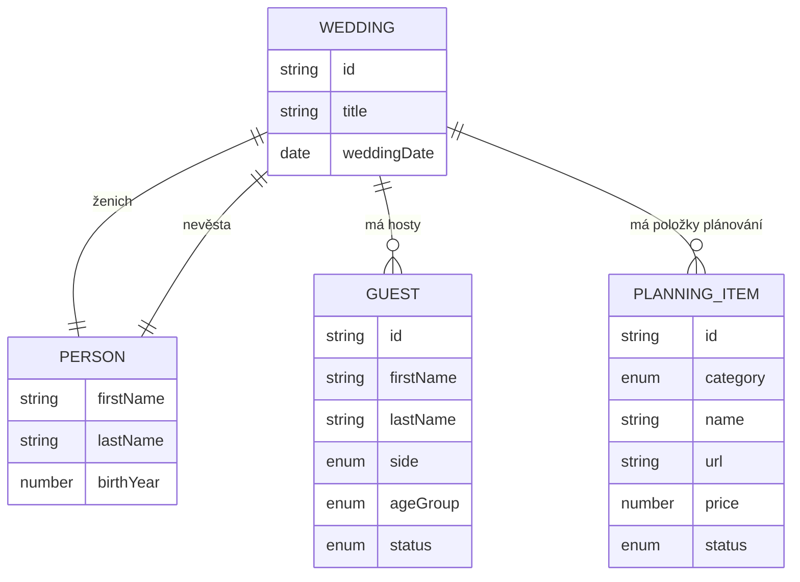
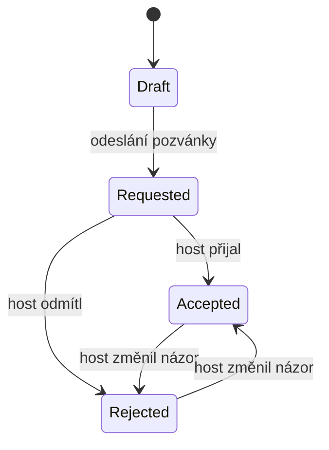

# 💍 IziWeddy – svatební plánovač

Mobilní webová aplikace pro plánování svatby. Umožňuje spravovat údaje o snoubencích, seznam hostů, jednotlivé oblasti přípravy (místo obřadu, veselka, květiny, šaty…) a automaticky počítá rozpočet.

IziWeddy je **jeden z produktů pod `fridrich.cloud`**, ne samostatný projekt. Rozdělení celku, sdílené balíčky a společná identita jsou popsané v [architecture.md](architecture.md).

| | |
|---|---|
| **Adresa** | `www.fridrich.cloud/izi-weddy` |
| **Modul API** | `/api/weddy/*` |
| **Frontend** | `apps/portal/src/weddy` – podstrom portálu, ne samostatná aplikace |
| **Sdílené typy** | `packages/weddy-shared` |
| **Přihlášení** | Společný účet `fridrich.cloud` – viz [architecture.md, kap. 5](architecture.md#5-identita-registrace-a-přihlášení) |

> ⚠️ **Poznámka k tomuto dokumentu.** Vznikl dřív než rozdělení projektu, takže
> kapitoly [3](#3-struktura-repozitáře), [7](#7-rest-api), [9](#9-ukládání-dat),
> [10](#10-lokální-vývoj) a [11](#11-nasazení) popisují IziWeddy jako samostatný
> repozitář. Platí místo nich [architecture.md](architecture.md); konkrétně:
> aplikace žije v `apps/portal/src/weddy`, endpointy mají prefix `/api/weddy`, backend
> je organizovaný domain-first podle [`CLAUDE.md`](../CLAUDE.md) a otázka
> přihlašování (kap. 12, otázka 1) je už zodpovězená – účet je společný pro
> všechny produkty. **Kapitoly 4, 5, 6, 8 a 12 platí beze změny** – to je
> vlastní zadání aplikace.

---

## Obsah

1. [Přehled](#1-přehled)
2. [Technologie](#2-technologie)
3. [Struktura repozitáře](#3-struktura-repozitáře)
4. [Doménový model](#4-doménový-model)
5. [Funkční specifikace](#5-funkční-specifikace)
6. [Obrazovky a navigace](#6-obrazovky-a-navigace)
7. [REST API](#7-rest-api)
8. [Validační pravidla](#8-validační-pravidla)
9. [Ukládání dat](#9-ukládání-dat)
10. [Lokální vývoj](#10-lokální-vývoj)
11. [Nasazení](#11-nasazení)
12. [Otevřené otázky a možná rozšíření](#12-otevřené-otázky-a-možná-rozšíření)

---

## 1. Přehled

| Oblast | Popis |
|---|---|
| **Cílová platforma** | Primárně mobilní zařízení (mobile-first), funkční i na desktopu |
| **Frontend** | Vue 3 + TypeScript |
| **Backend** | Azure Functions (TypeScript) |
| **Repozitář** | Jeden monorepozitář obsahující frontend, backend i sdílené typy |
| **Měna** | CZK (výchozí) |

### Hlavní moduly

- **Dashboard** – přehled všech plánování, vytvoření nového plánování.
- **Snoubenci** – údaje o ženichovi a nevěstě.
- **Hosté** – seznam hostů se stavem pozvánky.
- **Plánování** – jedenáct sekcí (místo obřadu, veselka, jídlo, …) s položkami od dodavatelů.
- **Rozpočet** – automatický součet všech zadaných cen.

---

## 2. Technologie

### Frontend (`apps/web`)

| Technologie | Účel |
|---|---|
| [Vue 3](https://vuejs.org/) (Composition API, `<script setup>`) | UI framework |
| [Vite](https://vitejs.dev/) | Build a dev server |
| TypeScript | Typová bezpečnost |
| [Vue Router](https://router.vuejs.org/) | Navigace mezi stránkami |
| [Pinia](https://pinia.vuejs.org/) | Správa stavu |
| UI knihovna *(k rozhodnutí)* | Např. Ionic Vue, Vuetify nebo Tailwind CSS – viz [otevřené otázky](#12-otevřené-otázky-a-možná-rozšíření) |

### Backend (`apps/api`)

| Technologie | Účel |
|---|---|
| Azure Functions v4 (Node.js programming model v4) | HTTP API |
| TypeScript | Typová bezpečnost |
| `@azure/functions` | Registrace HTTP triggerů |
| Azure Cosmos DB *(doporučeno)* | Úložiště dat |

### Sdílený balíček (`packages/shared`)

Obsahuje TypeScript typy, výčty (enumy) a validační logiku, které používá **frontend i backend**. Díky tomu je kontrakt API definovaný na jednom místě.

---

## 3. Struktura repozitáře

Repozitář využívá **npm workspaces**.

```
wedding-planner/
├── apps/
│   ├── web/                      # Vue 3 frontend
│   │   ├── src/
│   │   │   ├── api/              # HTTP klient pro volání Azure Functions
│   │   │   ├── components/       # Znovupoužitelné komponenty
│   │   │   ├── layouts/          # Layouty (např. layout s bottom navigací)
│   │   │   ├── router/           # Definice rout
│   │   │   ├── stores/           # Pinia stores
│   │   │   ├── views/            # Stránky (Dashboard, Guests, Budget, …)
│   │   │   ├── App.vue
│   │   │   └── main.ts
│   │   ├── index.html
│   │   ├── vite.config.ts
│   │   └── package.json
│   │
│   └── api/                      # Azure Functions backend
│       ├── src/
│       │   ├── functions/        # HTTP triggery (weddings.ts, guests.ts, …)
│       │   ├── repositories/     # Přístup k databázi
│       │   └── services/         # Business logika (např. výpočet rozpočtu)
│       ├── host.json
│       ├── local.settings.json   # Lokální konfigurace (NEcommitovat)
│       └── package.json
│
├── packages/
│   └── shared/                   # Sdílené typy, enumy a validace
│       ├── src/
│       │   ├── models.ts
│       │   ├── enums.ts
│       │   └── validation.ts
│       └── package.json
│
├── package.json                  # Root – definice workspaces a skriptů
├── staticwebapp.config.json      # Konfigurace Azure Static Web Apps
└── README.md
```

---

## 4. Doménový model

### 4.1 Diagram entit



### 4.2 Výčty (enumy)

#### Strana hosta – `GuestSide`

| Hodnota | Popis |
|---|---|
| `groom` | Host ženicha |
| `bride` | Host nevěsty |

#### Věková skupina – `AgeGroup`

| Hodnota | Popis |
|---|---|
| `adult` | Dospělý |
| `child` | Dítě |

#### Stav hosta – `GuestStatus`

| Hodnota | Zobrazení | Popis |
|---|---|---|
| `draft` | Návrh | Host je pouze navržený – může, ale nemusí být pozván |
| `requested` | Pozván | Pozvánka byla odeslána, čeká se na odpověď |
| `accepted` | Přijal | Host pozvání přijal |
| `rejected` | Odmítl | Host pozvání odmítl |



> Diagram znázorňuje běžný tok. Aplikace přechody **nevynucuje** – uživatel může stav libovolně změnit (např. opravit chybu).

#### Kategorie plánování – `PlanningCategory`

| Hodnota | Zobrazení |
|---|---|
| `ceremonyVenue` | Místo obřadu |
| `receptionVenue` | Místo veselky |
| `flowers` | Květiny |
| `decorations` | Výzdoba |
| `suit` | Oblek |
| `dress` | Šaty |
| `bachelorParty` | Rozlučka |
| `otherActivities` | Další aktivity |

#### Stav položky plánování – `PlanningItemStatus`

| Hodnota | Zobrazení | Popis |
|---|---|---|
| `draft` | Návrh | **Výchozí stav.** Možnost, o které se uvažuje |
| `accepted` | Schváleno | Vybraná / objednaná možnost |

### 4.3 TypeScript definice (`packages/shared`)

```ts
// enums.ts
export type GuestSide = 'groom' | 'bride';
export type AgeGroup = 'adult' | 'child';
export type GuestStatus = 'draft' | 'requested' | 'accepted' | 'rejected';
export type PlanningItemStatus = 'draft' | 'accepted';

export type PlanningCategory =
  | 'ceremonyVenue'
  | 'receptionVenue'
  | 'flowers'
  | 'decorations'
  | 'suit'
  | 'dress'
  | 'bachelorParty'
  | 'otherActivities';
```

```ts
// models.ts
export interface Person {
  firstName: string;
  lastName: string;
  birthYear?: number;
  email?: string;
  phone?: string;
  note?: string;
}

export interface Wedding {
  id: string;
  title: string;            // např. "Svatba Jana & Petra"
  weddingDate?: string;     // ISO 8601 (YYYY-MM-DD)
  groom: Person;
  bride: Person;
  createdAt: string;        // ISO 8601
  updatedAt: string;        // ISO 8601
}

export interface Guest {
  id: string;
  weddingId: string;
  firstName: string;
  lastName: string;
  side: GuestSide;
  ageGroup: AgeGroup;
  status: GuestStatus;      // výchozí: 'draft'
  note?: string;
  createdAt: string;
  updatedAt: string;
}

export interface PlanningItem {
  id: string;
  weddingId: string;
  category: PlanningCategory;
  name: string;
  url?: string;             // odkaz na dodavatele
  price?: number;           // v CZK, nepovinné
  status: PlanningItemStatus; // výchozí: 'draft'
  createdAt: string;
  updatedAt: string;
}
```

---

## 5. Funkční specifikace

### 5.1 Dashboard

Dashboard slouží **čistě pro přehled**.

- Zobrazuje seznam všech plánování (svateb) jako karty.
- Každá karta obsahuje:
  - název svatby a jména snoubenců,
  - datum svatby a počet dní do svatby (pokud je datum vyplněno),
  - počet hostů (celkem / přijalo),
  - celkový rozpočet.
- Tlačítko **„Přidat plánování"** otevře formulář pro vytvoření nové svatby.
- Kliknutím na kartu uživatel přejde do detailu plánování.

### 5.2 Snoubenci

Formulář se dvěma bloky – **Ženich** a **Nevěsta**. Oba mají stejná pole:

| Pole | Povinné | Poznámka |
|---|---|---|
| Jméno | ✅ | |
| Příjmení | ✅ | |
| Rok narození | ❌ | |
| E-mail | ❌ | |
| Telefon | ❌ | |
| Poznámka | ❌ | Volný text |

Společně s nimi se edituje i **název svatby** a **datum svatby**.

### 5.3 Hosté

Hosté se zobrazují v jedné společné tabulce.

#### Pole hosta

| Pole | Povinné | Výchozí hodnota |
|---|---|---|
| Jméno | ✅ | |
| Příjmení | ❌ | u členů rodiny se nevyplňuje – příjmení nese název rodiny |
| Strana (ženich / nevěsta) | ✅ | u členů rodiny ji určuje rodina |
| Věková skupina (dospělý / dítě) | ✅ | Dospělý |
| Stav | ✅ | Návrh (`draft`) |
| Rodina | ❌ | |
| Poznámka | ❌ | |

#### Rodiny

Rodinu (`Rodina Novákovi`) zadává uživatel **najednou**: název, stranu a seznam
členů. U každého člena volí věkovou skupinu, **stranu volí pro rodinu jako celek**.

> **Rodina nemá vlastní záznam.** Je to skupina hostů se stejným `family.id`
> a názvem. Díky tomu zůstává strana na hostovi, takže filtry i statistiky
> fungují beze změny – a nemůže se stát, že by se strana rodiny rozešla se
> stranou jejích členů. Cenou je, že přejmenování rodiny nebo její přesun na
> druhou stranu přepíše všechny její členy.

- Seznam členů je při úpravě **úplný**: kdo v něm chybí, přestává být hostem.
  Jinak by nešlo člena odebrat.
- Smazání rodiny smaže i všechny členy.
- Stav pozvánky si drží **každý člen zvlášť** – jeden z rodiny může odmítnout.
- Rodina bez členů nedává smysl, proto ji API odmítne.

#### Funkce

- **Přidání, úprava a smazání** hosta.
- **Rychlá změna stavu** přímo ze seznamu (bez otevírání formuláře).
- **Zadání celé rodiny najednou** – viz níže.
- **Filtrování** podle strany, věkové skupiny a stavu.
- **Vyhledávání** podle jména.
- **Řazení** podle příjmení (výchozí) nebo jména. Volba není filtr, takže ji
  „Zrušit filtry" nechává být. Při shodě rozhoduje to druhé jméno a porovnává
  se česky – `Čermák` patří za `Cach`, ne až za `Žák`.
- **Jméno se vypisuje v pořadí, ve kterém se řadí** (`Novák Petr` při řazení
  podle příjmení). Jinak vypadá seznam rozbitě: oko čte první slovo, takže
  `Jana Adamová, Petr Novák` působí jako náhodné pořadí.
- **Souhrnné statistiky** nad tabulkou:

| Statistika | Výpočet |
|---|---|
| Celkem hostů | všichni kromě `rejected` |
| Potvrzeno | počet `accepted` |
| Čeká na odpověď | počet `requested` |
| Návrhy | počet `draft` |
| Odmítnuto | počet `rejected` |
| Ženich / Nevěsta | rozdělení podle strany |
| Dospělí / Děti | rozdělení podle věkové skupiny |

#### Členění přehledu

Strana **není štítek u jména, ale celá sekce**. Seznam má dva oddíly –
*Ženich* a *Nevěsta* – a uvnitř každého stojí nejdřív rodiny jako ohraničené
bloky a pod nimi jednotlivci. U jména už se strana neopakuje, plyne z toho,
kde host stojí.

Členové rodiny se uvnitř bloku řadí podle zvoleného řazení, tedy abecedně
podle křestního jména – příjmení nemají. Pořadí, ve kterém je uživatel zapsal,
se nezachovává.

**Rodiny jsou sbalené.** Deset rodin po čtyřech členech je čtyřicet řádků
a přehled by se v nich ztratil, takže se ve výchozím stavu ukazuje jen
hlavička se souhrnem (`4 členové · 2 děti`). Rozbaluje se kliknutím.

> ℹ️ Při aktivním hledání nebo filtru se **všechny rodiny rozbalí samy**.
> Shoda schovaná ve sbalené rodině by vypadala, že host neexistuje.

> **Mobilní zobrazení:** Na úzkých displejích se tabulka vykresluje jako seznam karet (jméno, barevný štítek stavu, ikona strany a věkové skupiny). Na širších displejích jako klasická tabulka.

### 5.4 Sekce plánování

Aplikace obsahuje jedenáct pevně daných sekcí:

1. Místo obřadu
2. Místo veselky
3. Jídlo
4. Pití
5. Květiny
6. Výzdoba
7. Oblek
8. Šaty
9. Prstýnky
10. Rozlučka
11. Další aktivity

Pořadí není abecední, ale tematické: jídlo a pití stojí hned za místem
veselky, ke kterému se vážou, prstýnky za obleky a šaty.

Každá sekce obsahuje **libovolný počet položek** (např. více variant míst obřadu, mezi kterými se rozhoduje).

#### Pole položky

| Pole | Povinné | Výchozí hodnota | Poznámka |
|---|---|---|---|
| Název | ✅ | | |
| URL | ❌ | | Odkaz na dodavatele, otevírá se v nové záložce |
| Cena | ❌ | | Kladné číslo v CZK |
| Stav | ✅ | Návrh (`draft`) | Návrh / Schváleno |

#### Funkce

- Přehled sekcí zobrazuje u každé sekce počet položek, počet schválených položek a součet cen.
- V detailu sekce lze položky přidávat, upravovat, mazat a měnit jejich stav.

### 5.5 Rozpočet

Stránka Rozpočet **vezme všechny zadané částky** z položek plánování a sečte je.

#### Zobrazované hodnoty

| Hodnota | Výpočet |
|---|---|
| **Celkem** | součet cen všech položek |
| **Schváleno** | součet cen položek ve stavu `accepted` |
| **Návrhy** | součet cen položek ve stavu `draft` |
| **Rozpis podle sekcí** | celkem / schváleno / návrhy pro každou sekci |
| **Položky bez ceny** | počet položek, které nemají vyplněnou cenu (upozornění, že rozpočet nemusí být úplný) |

#### Pravidla výpočtu

- Položky bez ceny se do součtů **nezapočítávají** (počítají se jako 0), ale jsou evidovány v počtu „bez ceny".
- Rozpočet se **nikam neukládá** – vždy se počítá dynamicky z aktuálních položek.

```ts
// packages/shared/src/budget.ts
export interface BudgetBreakdown {
  total: number;
  accepted: number;
  draft: number;
  itemsWithoutPrice: number;
}

export interface BudgetSummary extends BudgetBreakdown {
  byCategory: Record<PlanningCategory, BudgetBreakdown>;
}

export function calculateBudget(items: PlanningItem[]): BudgetSummary {
  // Pro každou položku:
  //  - price === undefined → itemsWithoutPrice++
  //  - jinak přičíst k total a podle status k accepted / draft
  //  - totéž provést i v rámci byCategory[item.category]
}
```

> Funkce `calculateBudget` je ve sdíleném balíčku, takže ji lze použít jak na backendu (endpoint `/budget`), tak na frontendu (okamžitý přepočet bez volání API).

---

## 6. Obrazovky a navigace

### 6.1 Routy

Aplikace běží pod cestou **`/izi-weddy`** uvnitř portálu. Routy níže se proto
uvádějí relativně k tomuto základu – `/weddings/new` je v prohlížeči
`www.fridrich.cloud/izi-weddy/weddings/new`.

Základ nikde nefiguruje natvrdo: drží ho konstanta `WEDDY_BASE` v `weddy/routes.ts`
a odkazy si ho skládají přes `weddyPath('/weddings/new')`. Přesun pod jinou
cestu je tedy změna jednoho řádku.

| Routa | Stránka |
|---|---|
| `/` | Dashboard |
| `/weddings/new` | Nové plánování |
| `/weddings/:weddingId` | Přehled plánování (souhrn) |
| `/weddings/:weddingId/couple` | Snoubenci |
| `/weddings/:weddingId/guests` | Hosté |
| `/weddings/:weddingId/planning` | Přehled sekcí plánování |
| `/weddings/:weddingId/planning/:category` | Detail sekce (seznam položek) |
| `/weddings/:weddingId/budget` | Rozpočet |

### 6.2 Navigace na mobilu

V rámci detailu plánování je ve spodní části obrazovky **bottom navigation bar** se čtyřmi záložkami:

```
┌─────────────────────────────────────┐
│  ← Svatba Jana & Petra              │
├─────────────────────────────────────┤
│                                     │
│            (obsah stránky)          │
│                                     │
├─────────────────────────────────────┤
│  💑        👥        📋        💰    │
│ Snoubenci  Hosté  Plánování Rozpočet│
└─────────────────────────────────────┘
```

### 6.3 Zásady mobile-first UI

- Návrh začíná od šířky **360 px**, desktopové rozložení se řeší až přes media queries.
- Dotykové prvky mají minimální velikost **44 × 44 px**.
- Primární akce (např. „Přidat hosta") jako **plovoucí tlačítko (FAB)** v pravém dolním rohu.
- Formuláře se otevírají jako **bottom sheet** nebo na celou obrazovku.
- Stavy jsou rozlišené barevným štítkem **i textem** (nejen barvou – kvůli přístupnosti).
- Pro numerická pole (cena, rok) se používá `inputmode="numeric"`, aby se na mobilu otevřela číselná klávesnice.

---

## 7. REST API

Všechny endpointy mají prefix `/api`. Data se přenášejí ve formátu JSON.

### 7.1 Plánování (svatby)

| Metoda | Endpoint | Popis |
|---|---|---|
| `GET` | `/api/weddy/weddings` | Seznam svateb vč. souhrnných statistik pro dashboard |
| `POST` | `/api/weddy/weddings` | Vytvoření svatby |
| `GET` | `/api/weddy/weddings/{weddingId}` | Detail svatby |
| `PUT` | `/api/weddy/weddings/{weddingId}` | Úprava svatby (název, datum, snoubenci) |
| `DELETE` | `/api/weddy/weddings/{weddingId}` | Smazání svatby včetně hostů a položek |

### 7.2 Hosté

| Metoda | Endpoint | Popis |
|---|---|---|
| `GET` | `/api/weddy/weddings/{weddingId}/guests` | Seznam hostů (volitelné filtry `?side=`, `?ageGroup=`, `?status=`) |
| `POST` | `/api/weddy/weddings/{weddingId}/guests` | Přidání hosta |
| `PUT` | `/api/weddy/weddings/{weddingId}/guests/{guestId}` | Úprava hosta |
| `PATCH` | `/api/weddy/weddings/{weddingId}/guests/{guestId}/status` | Rychlá změna stavu |
| `DELETE` | `/api/weddy/weddings/{weddingId}/guests/{guestId}` | Smazání hosta |

#### Rodiny

Rodina nemá vlastní záznam, takže **čtecí endpoint neexistuje** – poskládá se
ze seznamu hostů přes `groupIntoFamilies()` v `@fridrich/weddy-shared`.

| Metoda | Endpoint | Popis |
|---|---|---|
| `POST` | `/api/weddy/weddings/{weddingId}/families` | Založení rodiny i se členy |
| `PUT` | `/api/weddy/weddings/{weddingId}/families/{familyId}` | Přepis rodiny; chybějící členové se smažou |
| `DELETE` | `/api/weddy/weddings/{weddingId}/families/{familyId}` | Smazání rodiny i všech členů |

```jsonc
// POST /api/weddy/weddings/{weddingId}/families
{
  "name": "Novákovi",
  "side": "groom",
  "members": [
    { "firstName": "Josef", "ageGroup": "adult" },
    { "firstName": "Martina", "ageGroup": "adult" },
    { "firstName": "Themos", "ageGroup": "child" },
    { "firstName": "Magdaléna", "ageGroup": "child" }
  ]
}
```

Při úpravě nese existující člen `id`; bez něj vznikne nový.

### 7.3 Položky plánování

| Metoda | Endpoint | Popis |
|---|---|---|
| `GET` | `/api/weddy/weddings/{weddingId}/items` | Seznam položek (volitelný filtr `?category=`) |
| `POST` | `/api/weddy/weddings/{weddingId}/items` | Přidání položky |
| `PUT` | `/api/weddy/weddings/{weddingId}/items/{itemId}` | Úprava položky |
| `PATCH` | `/api/weddy/weddings/{weddingId}/items/{itemId}/status` | Rychlá změna stavu |
| `DELETE` | `/api/weddy/weddings/{weddingId}/items/{itemId}` | Smazání položky |

### 7.4 Rozpočet

| Metoda | Endpoint | Popis |
|---|---|---|
| `GET` | `/api/weddy/weddings/{weddingId}/budget` | Vypočítaný rozpočet |

### 7.5 Příklady

**Vytvoření položky plánování**

```http
POST /api/weddy/weddings/7f3c.../items
Content-Type: application/json

{
  "category": "ceremonyVenue",
  "name": "Zámek Loučeň",
  "url": "https://www.example.com",
  "price": 45000
}
```

Odpověď `201 Created`:

```json
{
  "id": "a91b...",
  "weddingId": "7f3c...",
  "category": "ceremonyVenue",
  "name": "Zámek Loučeň",
  "url": "https://www.example.com",
  "price": 45000,
  "status": "draft",
  "createdAt": "2026-09-10T10:00:00Z",
  "updatedAt": "2026-09-10T10:00:00Z"
}
```

**Rozpočet**

```http
GET /api/weddy/weddings/7f3c.../budget
```

```json
{
  "total": 185000,
  "accepted": 120000,
  "draft": 65000,
  "itemsWithoutPrice": 2,
  "byCategory": {
    "ceremonyVenue":  { "total": 45000, "accepted": 45000, "draft": 0, "itemsWithoutPrice": 0 },
    "receptionVenue": { "total": 75000, "accepted": 75000, "draft": 0, "itemsWithoutPrice": 0 },
    "flowers":        { "total": 15000, "accepted": 0, "draft": 15000, "itemsWithoutPrice": 1 }
  }
}
```

### 7.6 Chybové odpovědi

| Kód | Kdy |
|---|---|
| `400 Bad Request` | Neplatná data (validace selhala) |
| `401 Unauthorized` | Uživatel není přihlášen *(pokud bude autentizace)* |
| `404 Not Found` | Svatba / host / položka neexistuje |
| `500 Internal Server Error` | Neočekávaná chyba serveru |

Formát chyby:

```json
{
  "error": "ValidationError",
  "message": "Neplatná data",
  "details": [
    { "field": "price", "message": "Cena musí být kladné číslo" }
  ]
}
```

### 7.7 Ukázka Azure Function

```ts
// apps/api/src/functions/items.ts
import { app, HttpRequest, HttpResponseInit } from '@azure/functions';
import { validatePlanningItem } from '@wedding-planner/shared';
import { itemRepository } from '../repositories/itemRepository';

app.http('createItem', {
  methods: ['POST'],
  route: 'weddings/{weddingId}/items',
  authLevel: 'anonymous',
  handler: async (request: HttpRequest): Promise<HttpResponseInit> => {
    const weddingId = request.params.weddingId;
    const body = await request.json();

    const result = validatePlanningItem(body);
    if (!result.valid) {
      return { status: 400, jsonBody: { error: 'ValidationError', details: result.errors } };
    }

    const item = await itemRepository.create(weddingId, {
      ...result.data,
      status: result.data.status ?? 'draft',
    });

    return { status: 201, jsonBody: item };
  },
});
```

---

## 8. Validační pravidla

Validace je implementována ve sdíleném balíčku a spouští se **na frontendu** (okamžitá zpětná vazba) i **na backendu** (bezpečnost).

| Entita | Pole | Pravidlo |
|---|---|---|
| Person | `firstName`, `lastName` | povinné, 1–100 znaků |
| Person | `birthYear` | celé číslo, 1900 – aktuální rok |
| Person | `email` | platný formát e-mailu |
| Wedding | `title` | povinné, 1–200 znaků |
| Wedding | `weddingDate` | platné datum ve formátu `YYYY-MM-DD` |
| Guest | `firstName`, `lastName` | povinné, 1–100 znaků |
| Guest | `side` | `groom` \| `bride` |
| Guest | `ageGroup` | `adult` \| `child` |
| Guest | `status` | `draft` \| `requested` \| `accepted` \| `rejected` |
| PlanningItem | `name` | povinné, 1–200 znaků |
| PlanningItem | `url` | pokud je vyplněno, musí být platná URL (`http://` nebo `https://`) |
| PlanningItem | `price` | pokud je vyplněno, číslo ≥ 0 |
| PlanningItem | `category` | jedna z 8 kategorií |
| PlanningItem | `status` | `draft` \| `accepted` |

---

## 9. Ukládání dat

**Doporučení:** Azure Cosmos DB (NoSQL API) v režimu **serverless** – pro aplikaci s malým provozem je nejlevnější a nevyžaduje správu kapacity.

| Kontejner | Partition key | Obsah |
|---|---|---|
| `weddings` | `/id` | Svatby včetně údajů o snoubencích |
| `guests` | `/weddingId` | Hosté |
| `planningItems` | `/weddingId` | Položky plánování |

Partition key `weddingId` zajistí, že všechny dotazy v rámci jedné svatby (seznam hostů, rozpočet) jsou levné a rychlé.

> **Alternativa:** Azure Table Storage – ještě levnější a jednodušší, ale s omezenějšími možnostmi dotazování.

---

## 10. Lokální vývoj

### Požadavky

- Node.js 20 LTS nebo novější
- Cosmos DB Emulator nebo připojení ke vzdálené Cosmos DB

[Azure Functions Core Tools v4](https://learn.microsoft.com/azure/azure-functions/functions-run-local)
přinese `npm install` jako devDependency `apps/api` – globálně se instalovat nemusí.

### Spuštění

```bash
# Instalace závislostí pro všechny workspaces
npm install

# Ve dvou terminálech
npm run dev:api      # :7071
npm run dev:portal   # :5173 – tudy se chodí
```

Plánovač se otevírá na **`http://localhost:5173/izi-weddy/`**. Vlastní dev
server nemá – je to táž aplikace jako portál. Když je port obsazený, Vite
uskočí na další volný a vypíše ho při startu.

### Doporučené skripty v root `package.json`

```json
{
  "private": true,
  "workspaces": ["apps/*", "packages/*"],
  "scripts": {
    "dev": "swa start http://localhost:5173 --run \"npm run dev -w apps/web\" --api-location apps/api",
    "build": "npm run build -w packages/shared && npm run build -w apps/api && npm run build -w apps/web",
    "lint": "npm run lint --workspaces --if-present",
    "test": "npm run test --workspaces --if-present"
  }
}
```

### Konfigurace API (`apps/api/local.settings.json`)

```json
{
  "IsEncrypted": false,
  "Values": {
    "FUNCTIONS_WORKER_RUNTIME": "node",
    "AzureWebJobsStorage": "UseDevelopmentStorage=true",
    "COSMOS_ENDPOINT": "https://localhost:8081",
    "COSMOS_KEY": "<klíč-emulátoru>",
    "COSMOS_DATABASE": "wedding-planner"
  }
}
```

> ⚠️ Soubor `local.settings.json` **necommitovat** – přidat do `.gitignore`.

---

## 11. Nasazení

> Závazný popis nasazení je v [architecture.md, kap. 9](architecture.md#9-nasazení).
> Tahle kapitola jen shrnuje, co z něj plyne pro IziWeddy.

IziWeddy se nenasazuje samostatně – je součástí portálu, takže ho publikuje
nasazení celého webu. Podrobnosti v [architecture.md, kap. 9](architecture.md#9-nasazení).

Cenou za to je, že **změna v plánovači znamená nové nasazení celého webu**.
Při téhle velikosti je to výhodnější než udržovat druhý build, druhé workflow
a přepisy cest ve Static Web Apps.

---

## 12. Otevřené otázky a možná rozšíření

### Otevřené otázky

| # | Otázka | Návrh |
|---|---|---|
| 1 | Bude aplikace mít přihlašování? Může plánování sdílet více uživatelů (např. oba snoubenci)? | Vestavěná autentizace Azure Static Web Apps (Microsoft / GitHub / Google účet) |
| 2 | Která UI knihovna? | **Ionic Vue** pro nativní mobilní vzhled, **Vuetify** pro Material Design, **Tailwind** pro plnou kontrolu nad vzhledem |
| 3 | Má být aplikace instalovatelná na plochu telefonu? | Ano – PWA přes `vite-plugin-pwa` |
| 4 | Má se u hosta evidovat, zda přijde s doprovodem? | Pole `plusOne: boolean` nebo propojení hostů do skupin/rodin |
| 5 | Může být v jedné sekci schváleno více položek? (např. u „Další aktivity" dává smysl, u „Místa obřadu" spíše ne) | Zatím povolit, případně jen zobrazit upozornění |

### Možná rozšíření

- 🎯 **Cílový rozpočet** – zadání maximální částky a zobrazení, kolik zbývá.
- 💳 **Zálohy a platby** – evidence zaplacené zálohy a zbývající částky u položek.
- ✅ **Checklist úkolů** s termíny (např. „objednat dort do 1. 5.").
- 🪑 **Zasedací pořádek** – rozmístění potvrzených hostů ke stolům.
- 🍽️ **Dietní omezení** hostů (vegetarián, alergie…).
- 📤 **Export** seznamu hostů a rozpočtu do CSV / Excelu.
- 🔔 **Notifikace** – připomenutí hostů, kteří dlouho neodpověděli na pozvánku.
- 🌙 **Tmavý režim**.
