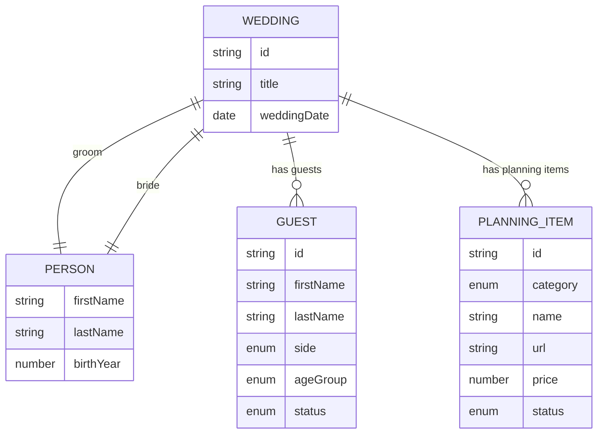
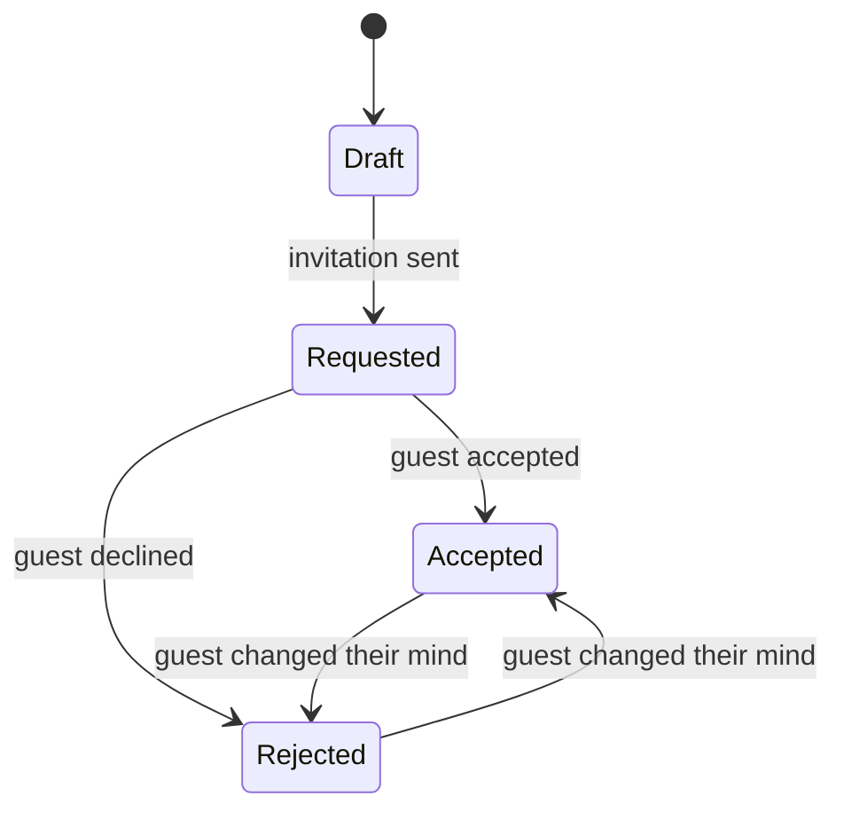

# 💍 IziWeddy – wedding planner

> Translated from the Czech original; the Czech text is in git history (commit 8db5e0a, file doc/iziweddy.md).

A mobile web application for planning a wedding. It lets you manage details about the engaged couple, the guest list, the individual areas of preparation (ceremony venue, reception, flowers, dress…) and automatically calculates the budget.

IziWeddy is **one of the products under `fridrich.cloud`**, not a standalone project. The breakdown of the whole, the shared packages and the common identity are described in [architecture.md](architecture.md).

| | |
|---|---|
| **Address** | `www.fridrich.cloud/izi-weddy` |
| **API module** | `/api/weddy/*` |
| **Frontend** | `apps/portal/src/weddy` – a subtree of the portal, not a standalone application |
| **Shared types** | `packages/weddy-shared` |
| **Sign-in** | Shared `fridrich.cloud` account – see [architecture.md, ch. 5](architecture.md#5-identita-registrace-a-přihlášení) |

> ⚠️ **Note on this document.** It was written before the project was split up, so
> chapters [3](#3-repository-structure), [7](#7-rest-api), [9](#9-data-storage),
> [10](#10-local-development) and [11](#11-deployment) describe IziWeddy as a standalone
> repository. [architecture.md](architecture.md) applies instead of them; specifically:
> the application lives in `apps/portal/src/weddy`, endpoints have the `/api/weddy` prefix, the backend
> is organised domain-first according to [`CLAUDE.md`](../CLAUDE.md), and the question
> of sign-in (ch. 12, question 1) has already been answered – the account is shared across
> all products. **Chapters 4, 5, 6, 8 and 12 apply unchanged** – they are
> the actual specification of the application.

---

## Contents

1. [Overview](#1-overview)
2. [Technologies](#2-technologies)
3. [Repository structure](#3-repository-structure)
4. [Domain model](#4-domain-model)
5. [Functional specification](#5-functional-specification)
6. [Screens and navigation](#6-screens-and-navigation)
7. [REST API](#7-rest-api)
8. [Validation rules](#8-validation-rules)
9. [Data storage](#9-data-storage)
10. [Local development](#10-local-development)
11. [Deployment](#11-deployment)
12. [Open questions and possible extensions](#12-open-questions-and-possible-extensions)

---

## 1. Overview

| Area | Description |
|---|---|
| **Target platform** | Primarily mobile devices (mobile-first), also functional on desktop |
| **Frontend** | Vue 3 + TypeScript |
| **Backend** | Azure Functions (TypeScript) |
| **Repository** | A single monorepo containing the frontend, backend and shared types |
| **Currency** | CZK (default) |

### Main modules

- **Dashboard** – overview of all plannings, creation of a new planning.
- **Couple** – details about the groom and the bride.
- **Guests** – guest list with invitation status.
- **Planning** – eleven sections (ceremony venue, reception, food, …) with items from vendors.
- **Budget** – automatic sum of all entered prices.

---

## 2. Technologies

### Frontend (`apps/web`)

| Technology | Purpose |
|---|---|
| [Vue 3](https://vuejs.org/) (Composition API, `<script setup>`) | UI framework |
| [Vite](https://vitejs.dev/) | Build and dev server |
| TypeScript | Type safety |
| [Vue Router](https://router.vuejs.org/) | Navigation between pages |
| [Pinia](https://pinia.vuejs.org/) | State management |
| UI library *(to be decided)* | E.g. Ionic Vue, Vuetify or Tailwind CSS – see [open questions](#12-open-questions-and-possible-extensions) |

### Backend (`apps/api`)

| Technology | Purpose |
|---|---|
| Azure Functions v4 (Node.js programming model v4) | HTTP API |
| TypeScript | Type safety |
| `@azure/functions` | Registration of HTTP triggers |
| Azure Cosmos DB *(recommended)* | Data storage |

### Shared package (`packages/shared`)

Contains TypeScript types, enumerations (enums) and validation logic used by **both the frontend and the backend**. This way the API contract is defined in one place.

---

## 3. Repository structure

The repository uses **npm workspaces**.

```
wedding-planner/
├── apps/
│   ├── web/                      # Vue 3 frontend
│   │   ├── src/
│   │   │   ├── api/              # HTTP client for calling Azure Functions
│   │   │   ├── components/       # Reusable components
│   │   │   ├── layouts/          # Layouts (e.g. layout with bottom navigation)
│   │   │   ├── router/           # Route definitions
│   │   │   ├── stores/           # Pinia stores
│   │   │   ├── views/            # Pages (Dashboard, Guests, Budget, …)
│   │   │   ├── App.vue
│   │   │   └── main.ts
│   │   ├── index.html
│   │   ├── vite.config.ts
│   │   └── package.json
│   │
│   └── api/                      # Azure Functions backend
│       ├── src/
│       │   ├── functions/        # HTTP triggers (weddings.ts, guests.ts, …)
│       │   ├── repositories/     # Database access
│       │   └── services/         # Business logic (e.g. budget calculation)
│       ├── host.json
│       ├── local.settings.json   # Local configuration (do NOT commit)
│       └── package.json
│
├── packages/
│   └── shared/                   # Shared types, enums and validation
│       ├── src/
│       │   ├── models.ts
│       │   ├── enums.ts
│       │   └── validation.ts
│       └── package.json
│
├── package.json                  # Root – workspaces and scripts definition
├── staticwebapp.config.json      # Azure Static Web Apps configuration
└── README.md
```

---

## 4. Domain model

### 4.1 Entity diagram



### 4.2 Enumerations (enums)

#### Guest side – `GuestSide`

| Value | Description |
|---|---|
| `groom` | Groom's guest |
| `bride` | Bride's guest |

#### Age group – `AgeGroup`

| Value | Description |
|---|---|
| `adult` | Adult |
| `child` | Child |

#### Guest status – `GuestStatus`

| Value | Display | Description |
|---|---|---|
| `draft` | Návrh (Draft) | The guest is only proposed – may or may not be invited |
| `requested` | Pozván (Invited) | The invitation has been sent, waiting for a reply |
| `accepted` | Přijal (Accepted) | The guest accepted the invitation |
| `rejected` | Odmítl (Declined) | The guest declined the invitation |



> The diagram shows the typical flow. The application **does not enforce** the transitions – the user can change the status freely (e.g. to fix a mistake).

#### Planning category – `PlanningCategory`

| Value | Display |
|---|---|
| `ceremonyVenue` | Místo obřadu (Ceremony venue) |
| `receptionVenue` | Místo veselky (Reception venue) |
| `flowers` | Květiny (Flowers) |
| `decorations` | Výzdoba (Decorations) |
| `suit` | Oblek (Suit) |
| `dress` | Šaty (Dress) |
| `bachelorParty` | Rozlučka (Bachelor/bachelorette party) |
| `otherActivities` | Další aktivity (Other activities) |

#### Planning item status – `PlanningItemStatus`

| Value | Display | Description |
|---|---|---|
| `draft` | Návrh | **Default status.** An option being considered |
| `accepted` | Schváleno (Approved) | The selected / ordered option |

### 4.3 TypeScript definitions (`packages/shared`)

```ts
// enums.ts
export type GuestSide = 'groom' | 'bride';
export type AgeGroup = 'adult' | 'child';
export type GuestStatus = 'draft' | 'requested' | 'accepted' | 'rejected';
export type PlanningItemStatus = 'draft' | 'accepted';

export type PlanningCategory =
  | 'ceremonyVenue'
  | 'receptionVenue'
  | 'flowers'
  | 'decorations'
  | 'suit'
  | 'dress'
  | 'bachelorParty'
  | 'otherActivities';
```

```ts
// models.ts
export interface Person {
  firstName: string;
  lastName: string;
  birthYear?: number;
  email?: string;
  phone?: string;
  note?: string;
}

export interface Wedding {
  id: string;
  title: string;            // e.g. "Svatba Jana & Petra"
  weddingDate?: string;     // ISO 8601 (YYYY-MM-DD)
  groom: Person;
  bride: Person;
  createdAt: string;        // ISO 8601
  updatedAt: string;        // ISO 8601
}

export interface Guest {
  id: string;
  weddingId: string;
  firstName: string;
  lastName: string;
  side: GuestSide;
  ageGroup: AgeGroup;
  status: GuestStatus;      // default: 'draft'
  note?: string;
  createdAt: string;
  updatedAt: string;
}

export interface PlanningItem {
  id: string;
  weddingId: string;
  category: PlanningCategory;
  name: string;
  url?: string;             // link to the vendor
  price?: number;           // in CZK, optional
  status: PlanningItemStatus; // default: 'draft'
  createdAt: string;
  updatedAt: string;
}
```

---

## 5. Functional specification

### 5.1 Dashboard

The dashboard serves **purely as an overview**.

- It displays a list of all plannings (weddings) as cards.
- Each card contains:
  - the wedding title and the names of the couple,
  - the wedding date and the number of days until the wedding (if the date is filled in),
  - the number of guests (total / accepted),
  - the total budget.
- The **"Přidat plánování" (Add planning)** button opens a form for creating a new wedding.
- Clicking a card takes the user to the planning detail.

### 5.2 Couple

A form with two blocks – **Ženich (Groom)** and **Nevěsta (Bride)**. Both have the same fields:

| Field | Required | Note |
|---|---|---|
| First name | ✅ | |
| Last name | ✅ | |
| Year of birth | ❌ | |
| E-mail | ❌ | |
| Phone | ❌ | |
| Note | ❌ | Free text |

The **wedding title** and **wedding date** are edited together with them.

### 5.3 Guests

Guests are displayed in a single shared table.

#### Guest fields

| Field | Required | Default value |
|---|---|---|
| First name | ✅ | |
| Last name | ❌ | not filled in for family members – the last name is carried by the family name |
| Side (groom / bride) | ✅ | for family members it is determined by the family |
| Age group (adult / child) | ✅ | Adult |
| Status | ✅ | Návrh (`draft`) |
| Family | ❌ | |
| Note | ❌ | |

#### Families

The user enters a family (`Rodina Novákovi` – the Novák family) **all at once**: name, side and a list of
members. For each member they choose the age group; **the side is chosen for the family as a whole**.

> **A family has no record of its own.** It is a group of guests with the same `family.id`
> and name. Thanks to this, the side stays on the guest, so filters and statistics
> work unchanged – and the family's side can never diverge from
> the side of its members. The price is that renaming a family or moving it to
> the other side rewrites all of its members.

- When editing, the member list is **complete**: anyone missing from it stops being a guest.
  Otherwise it would be impossible to remove a member.
- Deleting a family also deletes all its members.
- The invitation status is held by **each member separately** – one member of the family can decline.
- A family without members makes no sense, so the API rejects it.

#### Features

- **Adding, editing and deleting** a guest.
- **Quick status change** directly from the list (without opening the form).
- **Entering a whole family at once** – see below.
- **Filtering** by side, age group and status.
- **Searching** by name.
- **Sorting** by last name (default) or first name. The choice is not a filter, so
  "Zrušit filtry" (Clear filters) leaves it alone. On a tie the other name decides, and the comparison
  uses Czech collation – `Čermák` belongs after `Cach`, not after `Žák`.
- **The name is displayed in the order in which it is sorted** (`Novák Petr` when sorting
  by last name). Otherwise the list looks broken: the eye reads the first word, so
  `Jana Adamová, Petr Novák` comes across as a random order.
- **Summary statistics** above the table:

| Statistic | Calculation |
|---|---|
| Celkem hostů (Total guests) | everyone except `rejected` |
| Potvrzeno (Confirmed) | count of `accepted` |
| Čeká na odpověď (Awaiting reply) | count of `requested` |
| Návrhy (Drafts) | count of `draft` |
| Odmítnuto (Declined) | count of `rejected` |
| Ženich / Nevěsta (Groom / Bride) | breakdown by side |
| Dospělí / Děti (Adults / Children) | breakdown by age group |

#### Overview layout

The side **is not a tag next to the name, but a whole section**. The list has two parts –
*Ženich* and *Nevěsta* – and inside each, families come first as bordered
blocks, with individuals below them. The side is no longer repeated next to the name; it follows from
where the guest is placed.

Family members within a block are sorted according to the selected sorting, i.e. alphabetically
by first name – they have no last names. The order in which the user entered them
is not preserved.

**Families are collapsed.** Ten families of four members each make forty rows
and the overview would get lost in them, so by default only
a header with a summary (`4 členové · 2 děti` – 4 members · 2 children) is shown. It expands on click.

> ℹ️ When a search or filter is active, **all families expand automatically**.
> A match hidden inside a collapsed family would make it look as if the guest did not exist.

> **Mobile view:** On narrow displays the table is rendered as a list of cards (name, coloured status tag, side and age group icon). On wider displays as a classic table.

### 5.4 Planning sections

The application contains eleven fixed sections:

1. Místo obřadu (Ceremony venue)
2. Místo veselky (Reception venue)
3. Jídlo (Food)
4. Pití (Drinks)
5. Květiny (Flowers)
6. Výzdoba (Decorations)
7. Oblek (Suit)
8. Šaty (Dress)
9. Prstýnky (Rings)
10. Rozlučka (Bachelor/bachelorette party)
11. Další aktivity (Other activities)

The order is not alphabetical but thematic: food and drinks come right after the
reception venue they relate to, rings after the suit and dress.

Each section contains **any number of items** (e.g. several ceremony venue options to decide between).

#### Item fields

| Field | Required | Default value | Note |
|---|---|---|---|
| Name | ✅ | | |
| URL | ❌ | | Link to the vendor, opens in a new tab |
| Price | ❌ | | Positive number in CZK |
| Status | ✅ | Návrh (`draft`) | Návrh / Schváleno |

#### Features

- The section overview shows, for each section, the number of items, the number of approved items and the sum of prices.
- In the section detail, items can be added, edited, deleted and their status changed.

### 5.5 Budget

The Budget page **takes all entered amounts** from the planning items and adds them up.

#### Displayed values

| Value | Calculation |
|---|---|
| **Celkem (Total)** | sum of prices of all items |
| **Schváleno** | sum of prices of items with status `accepted` |
| **Návrhy** | sum of prices of items with status `draft` |
| **Rozpis podle sekcí (Breakdown by section)** | total / approved / drafts for each section |
| **Položky bez ceny (Items without a price)** | number of items that have no price filled in (a warning that the budget may be incomplete) |

#### Calculation rules

- Items without a price are **not included** in the sums (they count as 0), but they are tracked in the "without a price" count.
- The budget is **not stored anywhere** – it is always calculated dynamically from the current items.

```ts
// packages/shared/src/budget.ts
export interface BudgetBreakdown {
  total: number;
  accepted: number;
  draft: number;
  itemsWithoutPrice: number;
}

export interface BudgetSummary extends BudgetBreakdown {
  byCategory: Record<PlanningCategory, BudgetBreakdown>;
}

export function calculateBudget(items: PlanningItem[]): BudgetSummary {
  // For each item:
  //  - price === undefined → itemsWithoutPrice++
  //  - otherwise add to total and, depending on status, to accepted / draft
  //  - do the same within byCategory[item.category]
}
```

> The `calculateBudget` function lives in the shared package, so it can be used both on the backend (the `/budget` endpoint) and on the frontend (instant recalculation without calling the API).

---

## 6. Screens and navigation

### 6.1 Routes

The application runs under the **`/izi-weddy`** path inside the portal. The routes below are therefore
given relative to this base – `/weddings/new` is, in the browser,
`www.fridrich.cloud/izi-weddy/weddings/new`.

The base is not hard-coded anywhere: it is held by the `WEDDY_BASE` constant in `weddy/routes.ts`
and links compose it via `weddyPath('/weddings/new')`. Moving under a different
path is therefore a one-line change.

| Route | Page |
|---|---|
| `/` | Dashboard |
| `/weddings/new` | New planning |
| `/weddings/:weddingId` | Planning overview (summary) |
| `/weddings/:weddingId/couple` | Couple |
| `/weddings/:weddingId/guests` | Guests |
| `/weddings/:weddingId/planning` | Planning sections overview |
| `/weddings/:weddingId/planning/:category` | Section detail (list of items) |
| `/weddings/:weddingId/budget` | Budget |

### 6.2 Mobile navigation

Within the planning detail, there is a **bottom navigation bar** at the bottom of the screen with four tabs:

```
┌─────────────────────────────────────┐
│  ← Svatba Jana & Petra              │
├─────────────────────────────────────┤
│                                     │
│            (obsah stránky)          │
│                                     │
├─────────────────────────────────────┤
│  💑        👥        📋        💰    │
│ Snoubenci  Hosté  Plánování Rozpočet│
└─────────────────────────────────────┘
```

### 6.3 Mobile-first UI principles

- The design starts at a width of **360 px**; the desktop layout is handled only via media queries.
- Touch targets have a minimum size of **44 × 44 px**.
- The primary action (e.g. "Přidat hosta" (Add guest)) as a **floating action button (FAB)** in the bottom right corner.
- Forms open as a **bottom sheet** or full screen.
- Statuses are distinguished by a coloured tag **and by text** (not just by colour – for accessibility).
- Numeric fields (price, year) use `inputmode="numeric"` so that a numeric keyboard opens on mobile.

---

## 7. REST API

All endpoints have the `/api` prefix. Data is transferred in JSON format.

### 7.1 Plannings (weddings)

| Method | Endpoint | Description |
|---|---|---|
| `GET` | `/api/weddy/weddings` | List of weddings incl. summary statistics for the dashboard |
| `POST` | `/api/weddy/weddings` | Create a wedding |
| `GET` | `/api/weddy/weddings/{weddingId}` | Wedding detail |
| `PUT` | `/api/weddy/weddings/{weddingId}` | Update a wedding (title, date, couple) |
| `DELETE` | `/api/weddy/weddings/{weddingId}` | Delete a wedding including its guests and items |

### 7.2 Guests

| Method | Endpoint | Description |
|---|---|---|
| `GET` | `/api/weddy/weddings/{weddingId}/guests` | List of guests (optional filters `?side=`, `?ageGroup=`, `?status=`) |
| `POST` | `/api/weddy/weddings/{weddingId}/guests` | Add a guest |
| `PUT` | `/api/weddy/weddings/{weddingId}/guests/{guestId}` | Update a guest |
| `PATCH` | `/api/weddy/weddings/{weddingId}/guests/{guestId}/status` | Quick status change |
| `DELETE` | `/api/weddy/weddings/{weddingId}/guests/{guestId}` | Delete a guest |

#### Families

A family has no record of its own, so **there is no read endpoint** – it is assembled
from the guest list via `groupIntoFamilies()` in `@fridrich/weddy-shared`.

| Method | Endpoint | Description |
|---|---|---|
| `POST` | `/api/weddy/weddings/{weddingId}/families` | Create a family together with its members |
| `PUT` | `/api/weddy/weddings/{weddingId}/families/{familyId}` | Overwrite a family; missing members are deleted |
| `DELETE` | `/api/weddy/weddings/{weddingId}/families/{familyId}` | Delete a family and all its members |

```jsonc
// POST /api/weddy/weddings/{weddingId}/families
{
  "name": "Novákovi",
  "side": "groom",
  "members": [
    { "firstName": "Josef", "ageGroup": "adult" },
    { "firstName": "Martina", "ageGroup": "adult" },
    { "firstName": "Themos", "ageGroup": "child" },
    { "firstName": "Magdaléna", "ageGroup": "child" }
  ]
}
```

When updating, an existing member carries its `id`; without it, a new one is created.

### 7.3 Planning items

| Method | Endpoint | Description |
|---|---|---|
| `GET` | `/api/weddy/weddings/{weddingId}/items` | List of items (optional filter `?category=`) |
| `POST` | `/api/weddy/weddings/{weddingId}/items` | Add an item |
| `PUT` | `/api/weddy/weddings/{weddingId}/items/{itemId}` | Update an item |
| `PATCH` | `/api/weddy/weddings/{weddingId}/items/{itemId}/status` | Quick status change |
| `DELETE` | `/api/weddy/weddings/{weddingId}/items/{itemId}` | Delete an item |

### 7.4 Budget

| Method | Endpoint | Description |
|---|---|---|
| `GET` | `/api/weddy/weddings/{weddingId}/budget` | Calculated budget |

### 7.5 Examples

**Creating a planning item**

```http
POST /api/weddy/weddings/7f3c.../items
Content-Type: application/json

{
  "category": "ceremonyVenue",
  "name": "Zámek Loučeň",
  "url": "https://www.example.com",
  "price": 45000
}
```

Response `201 Created`:

```json
{
  "id": "a91b...",
  "weddingId": "7f3c...",
  "category": "ceremonyVenue",
  "name": "Zámek Loučeň",
  "url": "https://www.example.com",
  "price": 45000,
  "status": "draft",
  "createdAt": "2026-09-10T10:00:00Z",
  "updatedAt": "2026-09-10T10:00:00Z"
}
```

**Budget**

```http
GET /api/weddy/weddings/7f3c.../budget
```

```json
{
  "total": 185000,
  "accepted": 120000,
  "draft": 65000,
  "itemsWithoutPrice": 2,
  "byCategory": {
    "ceremonyVenue":  { "total": 45000, "accepted": 45000, "draft": 0, "itemsWithoutPrice": 0 },
    "receptionVenue": { "total": 75000, "accepted": 75000, "draft": 0, "itemsWithoutPrice": 0 },
    "flowers":        { "total": 15000, "accepted": 0, "draft": 15000, "itemsWithoutPrice": 1 }
  }
}
```

### 7.6 Error responses

| Code | When |
|---|---|
| `400 Bad Request` | Invalid data (validation failed) |
| `401 Unauthorized` | The user is not signed in *(if there will be authentication)* |
| `404 Not Found` | The wedding / guest / item does not exist |
| `500 Internal Server Error` | Unexpected server error |

Error format:

```json
{
  "error": "ValidationError",
  "message": "Neplatná data",
  "details": [
    { "field": "price", "message": "Cena musí být kladné číslo" }
  ]
}
```

### 7.7 Azure Function example

```ts
// apps/api/src/functions/items.ts
import { app, HttpRequest, HttpResponseInit } from '@azure/functions';
import { validatePlanningItem } from '@wedding-planner/shared';
import { itemRepository } from '../repositories/itemRepository';

app.http('createItem', {
  methods: ['POST'],
  route: 'weddings/{weddingId}/items',
  authLevel: 'anonymous',
  handler: async (request: HttpRequest): Promise<HttpResponseInit> => {
    const weddingId = request.params.weddingId;
    const body = await request.json();

    const result = validatePlanningItem(body);
    if (!result.valid) {
      return { status: 400, jsonBody: { error: 'ValidationError', details: result.errors } };
    }

    const item = await itemRepository.create(weddingId, {
      ...result.data,
      status: result.data.status ?? 'draft',
    });

    return { status: 201, jsonBody: item };
  },
});
```

---

## 8. Validation rules

Validation is implemented in the shared package and runs **on the frontend** (instant feedback) as well as **on the backend** (security).

| Entity | Field | Rule |
|---|---|---|
| Person | `firstName`, `lastName` | required, 1–100 characters |
| Person | `birthYear` | integer, 1900 – current year |
| Person | `email` | valid e-mail format |
| Wedding | `title` | required, 1–200 characters |
| Wedding | `weddingDate` | valid date in `YYYY-MM-DD` format |
| Guest | `firstName`, `lastName` | required, 1–100 characters |
| Guest | `side` | `groom` \| `bride` |
| Guest | `ageGroup` | `adult` \| `child` |
| Guest | `status` | `draft` \| `requested` \| `accepted` \| `rejected` |
| PlanningItem | `name` | required, 1–200 characters |
| PlanningItem | `url` | if filled in, must be a valid URL (`http://` or `https://`) |
| PlanningItem | `price` | if filled in, a number ≥ 0 |
| PlanningItem | `category` | one of the 8 categories |
| PlanningItem | `status` | `draft` \| `accepted` |

---

## 9. Data storage

**Recommendation:** Azure Cosmos DB (NoSQL API) in **serverless** mode – for a low-traffic application it is the cheapest option and requires no capacity management.

| Container | Partition key | Contents |
|---|---|---|
| `weddings` | `/id` | Weddings including details about the couple |
| `guests` | `/weddingId` | Guests |
| `planningItems` | `/weddingId` | Planning items |

The `weddingId` partition key ensures that all queries within a single wedding (guest list, budget) are cheap and fast.

> **Alternative:** Azure Table Storage – even cheaper and simpler, but with more limited querying capabilities.

---

## 10. Local development

### Requirements

- Node.js 20 LTS or newer
- Cosmos DB Emulator or a connection to a remote Cosmos DB

[Azure Functions Core Tools v4](https://learn.microsoft.com/azure/azure-functions/functions-run-local)
are brought in by `npm install` as a devDependency of `apps/api` – they do not need to be installed globally.

### Running

```bash
# Install dependencies for all workspaces
npm install

# In two terminals
npm run dev:api      # :7071
npm run dev:portal   # :5173 – this is the one you open
```

The planner opens at **`http://localhost:5173/izi-weddy/`**. It has no dev
server of its own – it is the same application as the portal. If the port is taken, Vite
moves to the next free one and prints it at startup.

### Recommended scripts in the root `package.json`

```json
{
  "private": true,
  "workspaces": ["apps/*", "packages/*"],
  "scripts": {
    "dev": "swa start http://localhost:5173 --run \"npm run dev -w apps/web\" --api-location apps/api",
    "build": "npm run build -w packages/shared && npm run build -w apps/api && npm run build -w apps/web",
    "lint": "npm run lint --workspaces --if-present",
    "test": "npm run test --workspaces --if-present"
  }
}
```

### API configuration (`apps/api/local.settings.json`)

```json
{
  "IsEncrypted": false,
  "Values": {
    "FUNCTIONS_WORKER_RUNTIME": "node",
    "AzureWebJobsStorage": "UseDevelopmentStorage=true",
    "COSMOS_ENDPOINT": "https://localhost:8081",
    "COSMOS_KEY": "<emulator-key>",
    "COSMOS_DATABASE": "wedding-planner"
  }
}
```

> ⚠️ **Do not commit** the `local.settings.json` file – add it to `.gitignore`.

---

## 11. Deployment

> The authoritative description of deployment is in [architecture.md, ch. 9](architecture.md#9-nasazení).
> This chapter only summarises what follows from it for IziWeddy.

IziWeddy is not deployed on its own – it is part of the portal, so it is published by
the deployment of the whole website. Details in [architecture.md, ch. 9](architecture.md#9-nasazení).

The price for this is that **a change in the planner means a new deployment of the whole website**.
At this size that is preferable to maintaining a second build, a second workflow
and path rewrites in Static Web Apps.

---

## 12. Open questions and possible extensions

### Open questions

| # | Question | Proposal |
|---|---|---|
| 1 | Will the application have sign-in? Can a planning be shared by multiple users (e.g. both partners)? | Built-in Azure Static Web Apps authentication (Microsoft / GitHub / Google account) |
| 2 | Which UI library? | **Ionic Vue** for a native mobile look, **Vuetify** for Material Design, **Tailwind** for full control over the look |
| 3 | Should the application be installable on the phone's home screen? | Yes – PWA via `vite-plugin-pwa` |
| 4 | Should we track whether a guest is bringing a companion? | A `plusOne: boolean` field or linking guests into groups/families |
| 5 | Can more than one item be approved in a single section? (e.g. for "Další aktivity" it makes sense, for "Místo obřadu" rather not) | Allow it for now, possibly just show a warning |

### Possible extensions

- 🎯 **Target budget** – entering a maximum amount and showing how much remains.
- 💳 **Deposits and payments** – tracking the deposit paid and the remaining amount for items.
- ✅ **Task checklist** with deadlines (e.g. "order the cake by 1 May").
- 🪑 **Seating plan** – assigning confirmed guests to tables.
- 🍽️ **Dietary restrictions** of guests (vegetarian, allergies…).
- 📤 **Export** of the guest list and budget to CSV / Excel.
- 🔔 **Notifications** – reminders for guests who have not replied to the invitation for a long time.
- 🌙 **Dark mode**.
