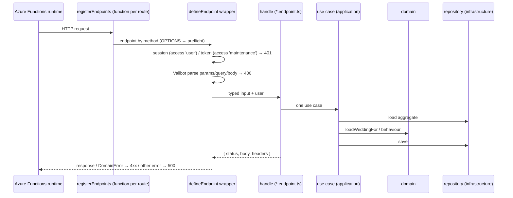

# Backend – `apps/api`

> One Azure Functions app (Node.js, programming model **v4**, HTTP triggers
> only), split by domain internally. Domain objects are the core; endpoints and
> Cosmos repositories are thin adapters around them.

## Structure

```
apps/api/
├── src/
│   ├── index.ts                  # list of all endpoints → registerEndpoints() (personal data ones behind the GDPR switch)
│   ├── config.ts                 # Application settings, container names
│   ├── domain/                   # domain – knows nothing about HTTP or the Cosmos SDK
│   │   ├── shared/               # DomainError, Clock
│   │   ├── identity/             # User, EmailAddress, LoginCode, OneTimeToken, Session, ports.ts
│   │   ├── contact/              # ContactMessage (+ port)
│   │   └── weddy/
│   │       ├── wedding/          # Wedding, WeddingRepository
│   │       ├── guests/           # Guest, Family (createFamily, rewriteFamily), GuestRepository
│   │       └── planning/         # PlanningItem, PlanningItemRepository
│   ├── application/              # use cases – orchestration over the domain
│   │   ├── identity/             # registerUser, login, session, verifyEmail, account (deleteAccount, applyAccountRetention), emails
│   │   ├── contact/              # submitContactMessage
│   │   └── weddy/                # deps, wedding, guests (incl. families), planning, budget
│   ├── endpoints/                # HTTP contract – 1 file = 1 endpoint
│   │   ├── identity/  contact/
│   │   └── weddy/{wedding,guests,planning,budget}/
│   ├── http/
│   │   ├── endpoint.ts           # defineEndpoint, registerEndpoints
│   │   ├── responses.ts          # json, noContent, errors, CORS, clientIp
│   │   └── cookies.ts            # session cookie
│   └── infrastructure/
│       ├── container.ts          # dependency composition (the only place where domain meets infrastructure)
│       ├── cosmos/               # client, identity/weddy/support repositories
│       ├── email/senders.ts      # SMTP / Azure Communication Services / console
│       └── crypto.ts             # tokens, codes, UUIDs
├── test/                         # node:test over dist/, in-memory repositories (fakes.ts)
├── scripts/build-deploy.mjs      # esbuild bundle for deployment
└── host.json
```

## Request lifecycle



## Rules

1. **Endpoints are thin** – see [endpoints.md](endpoints.md).
2. **Use case** (`application/<domain>/<subdomain>.ts`) receives dependencies as
   a parameter (`deps: WeddyDeps`) and typed input. It loads the aggregate,
   checks access (`loadWeddingFor`), calls the domain and saves. It returns data
   for the response (`toState()` / `toPublic()`).
3. **Domain** (`domain/`) – classes with a private constructor, factories
   `create(...)` and `fromState(...)`, methods with behaviour, `toState()` for
   the repository and `toPublic()` where part of the state must not leak
   (`ownerIds`). Time via `Clock`, IDs via `IdGenerator` / `nextId`.
4. **Ports** (`<Aggregate>Repository.ts`, `identity/ports.ts`) are interfaces in
   the domain; Cosmos DB implementations are in `infrastructure/cosmos`.
   Document ↔ domain mapping (partition key, `_ts`, `stripSystemFields`) lives
   only in the repository.
5. **Errors:** the domain and use cases throw `DomainError` with a `kind`
   (`validation`, `unauthorized`, `forbidden`, `notFound`, `conflict`,
   `tooManyRequests`). Translation to HTTP happens only in `http/responses.ts`.
6. **No Cosmos SDK types** outside `infrastructure/cosmos`.
7. **Composition over inheritance** – no abstract base classes for domain objects.

## Tests

| Level | File | How |
|---|---|---|
| Domain + use cases | `test/identity.test.ts`, `test/account.test.ts` (deletion, retention), `test/weddy.test.ts` | in-memory repositories from `test/fakes.ts`, `FixedClock`; no SDK mocks |
| Input rules (shared schemas) | `test/schemas.test.ts` | `v.safeParse` + `issuesToDetails`, asserts field paths |
| Endpoint wrapper | `test/endpoint.test.ts` | fake `HttpRequest`: 400 with details, `DomainError` translation, 500 without text, maintenance token |
| HTTP helpers | `test/http.test.ts` | `clientIp`, cookies |
| Production cryptography | `test/crypto.test.ts` | the real `tokenGenerator` |

`npm run test -w apps/api` builds `dist/` and runs `node --test`. CI checks that
at least 60 tests ran (117 today) – see [deployment.md](../operations/deployment.md).

## CORS

In production there is no CORS – the API is on the same origin as the website.
The headers are still handled in code (`corsHeaders`) based on
`ALLOWED_ORIGINS`: for a foreign origin a concrete origin and
`Access-Control-Allow-Credentials: true` must be sent, because the session
cookie is included. `OPTIONS` is served by `registerEndpoints` for every route.

## Related

- [Domain architecture](domains.md) · [Endpoints](endpoints.md) · [Valibot](valibot.md)
- [Data in Cosmos DB](dataCosmos.md)
- [Identity and security](../domains/identity.md)
