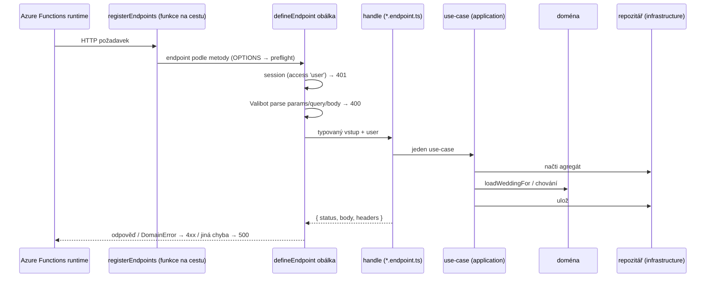

# Backend – `apps/api`

> Jedna Azure Functions aplikace (Node.js, programovací model **v4**, jen HTTP
> triggery), uvnitř rozdělená podle domén. Doménové objekty jsou jádro,
> endpointy a Cosmos repozitáře tenké adaptéry kolem nich.

## Struktura

```
apps/api/
├── src/
│   ├── index.ts                  # seznam všech endpointů → registerEndpoints()
│   ├── config.ts                 # Application settings, názvy kontejnerů
│   ├── domain/                   # doména – nezná HTTP ani Cosmos SDK
│   │   ├── shared/               # DomainError, Clock
│   │   ├── identity/             # User, EmailAddress, LoginCode, OneTimeToken, Session, ports.ts
│   │   ├── contact/              # ContactMessage (+ port)
│   │   └── weddy/
│   │       ├── wedding/          # Wedding, WeddingRepository
│   │       ├── guests/           # Guest, Family (createFamily, rewriteFamily), GuestRepository
│   │       └── planning/         # PlanningItem, PlanningItemRepository
│   ├── application/              # use-casy – orchestrace nad doménou
│   │   ├── identity/             # registerUser, login (requestLoginCode, verifyLoginCode), session, verifyEmail, emails
│   │   ├── contact/              # submitContactMessage
│   │   └── weddy/                # deps, wedding, guests (vč. rodin), planning, budget
│   ├── endpoints/                # HTTP kontrakt – 1 soubor = 1 endpoint
│   │   ├── identity/  contact/
│   │   └── weddy/{wedding,guests,planning,budget}/
│   ├── http/
│   │   ├── endpoint.ts           # defineEndpoint, registerEndpoints
│   │   ├── responses.ts          # json, noContent, chyby, CORS, clientIp
│   │   └── cookies.ts            # session cookie
│   └── infrastructure/
│       ├── container.ts          # složení závislostí (jediné místo, kde se potká doména s infrastrukturou)
│       ├── cosmos/               # client, identity/weddy/support repozitáře
│       ├── email/senders.ts      # SMTP / Azure Communication Services / konzole
│       └── crypto.ts             # tokeny, kódy, UUID
├── test/                         # node:test nad dist/, paměťové repozitáře (fakes.ts)
├── scripts/build-deploy.mjs      # esbuild bundle pro nasazení
└── host.json
```

## Životní cyklus požadavku



## Pravidla

1. **Endpoint je tenký** – viz [endpointy.md](endpointy.md).
2. **Use-case** (`application/<doména>/<subdoména>.ts`) dostává závislosti
   parametrem (`deps: WeddyDeps`) a typovaný vstup. Načte agregát, ověří
   přístup (`loadWeddingFor`), zavolá doménu, uloží. Vrací data pro odpověď
   (`toState()` / `toPublic()`).
3. **Doména** (`domain/`) – třídy s privátním konstruktorem, továrny
   `create(...)` a `fromState(...)`, metody s chováním, `toState()` pro
   repozitář a `toPublic()` tam, kde se část stavu nesmí dostat ven
   (`ownerIds`). Čas přes `Clock`, ID přes `IdGenerator` / `nextId`.
4. **Porty** (`<Agregát>Repository.ts`, `identity/ports.ts`) jsou rozhraní
   v doméně; implementace nad Cosmos DB jsou v `infrastructure/cosmos`.
   Mapování dokument ↔ doména (partition key, `_ts`, `stripSystemFields`)
   je výhradně v repozitáři.
5. **Chyby:** doména a use-case vyhazují `DomainError` s `kind`
   (`validation`, `unauthorized`, `forbidden`, `notFound`, `conflict`,
   `tooManyRequests`). Překlad na HTTP je jen v `http/responses.ts`.
6. **Žádné typy Cosmos SDK** mimo `infrastructure/cosmos`.
7. **Kompozice místo dědičnosti** – žádné abstraktní báze doménových objektů.

## Testy

| Úroveň | Soubor | Jak |
|---|---|---|
| Doména + use-casy | `test/identity.test.ts`, `test/weddy.test.ts` | paměťové repozitáře z `test/fakes.ts`, `FixedClock`; žádné mockování SDK |
| Pravidla vstupů (sdílená schémata) | `test/schemas.test.ts` | `v.safeParse` + `issuesToDetails`, kontroluje cesty polí |
| Obálka endpointu | `test/endpoint.test.ts` | falešný `HttpRequest`: 400 s detaily, překlad `DomainError`, 500 bez textu |
| HTTP pomocníci | `test/http.test.ts` | `clientIp`, cookies |
| Produkční kryptografie | `test/crypto.test.ts` | skutečný `tokenGenerator` |

`npm run test -w apps/api` sestaví `dist/` a spustí `node --test`. CI hlídá,
že proběhlo aspoň 60 testů (dnes 97) – viz [nasazeni.md](../provoz/nasazeni.md).

## CORS

V produkci žádné CORS nevzniká – API je na stejném originu jako web. Hlavičky
přesto řeší kód (`corsHeaders`) podle `ALLOWED_ORIGINS`: při cizím původu
musí jít konkrétní origin a `Access-Control-Allow-Credentials: true`, protože
se posílá session cookie. `OPTIONS` obslouží `registerEndpoints` pro každou cestu.

## Související

- [Doménová architektura](domeny.md) · [Endpointy](endpointy.md) · [Valibot](valibot.md)
- [Data v Cosmos DB](data-cosmos.md)
- [Identita a bezpečnost](../domeny/identity.md)
