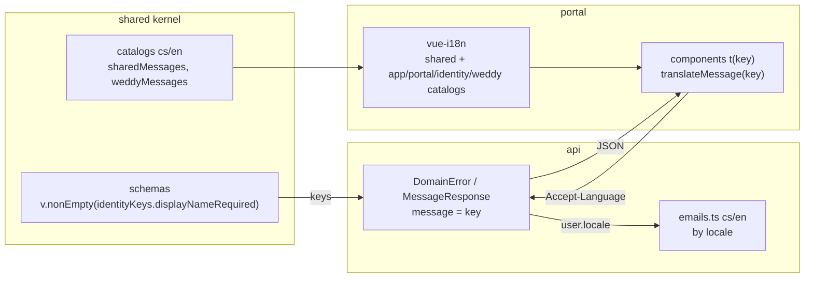

# Translations (i18n)

> The UI is **Czech and English** via [vue-i18n](https://vue-i18n.intlify.dev)
> (Composition API). No component contains a user-facing sentence: texts live in
> typed catalogs, shared schemas and the API return **message keys**, and e-mails
> are sent in the user's language. Legal documents stay Czech only.

## Overview

| Piece | Where | Content |
|---|---|---|
| Locales | `packages/shared/src/i18n.ts` | `LOCALES = ['cs','en']`, `DEFAULT_LOCALE = 'cs'`, `resolveLocale(header)`, `Catalog<T>`, `messageKeys()` |
| Shared messages | catalog next to the schemas in each subdomain file (`identity.ts`, `contact.ts`, `api.ts`, `validation.ts`; `weddy-shared/wedding.ts`, `guests.ts`, `planning.ts`), aggregated in `messages.ts` | validation messages, API errors, enum labels (guest status, planning category, …) |
| Keys | `identityKeys`, `contactKeys`, `commonKeys`, `errorKeys`, `weddingKeys`, `guestsKeys`, `planningKeys` | objects with the catalog's shape whose leaves are full keys (`shared.identity.emailInvalid`) |
| UI catalogs | `apps/portal/src/i18n/locales/{app,portal,identity,weddy,weddyGuests,weddyPlanning}.ts` | screen texts per area |
| vue-i18n setup | `apps/portal/src/i18n/index.ts` | merge, locale detection, Czech plural rule, `setLocale`, `currentLocale`, `translateMessage` |
| Switcher | `apps/portal/src/components/LocaleSwitcher.vue` | CZ \| EN in the portal navigation and in IziWeddy headers |
| E-mails | `apps/api/src/application/identity/emails.ts` | every e-mail in cs and en |

## Namespaces

| Namespace | Owner | Examples |
|---|---|---|
| `shared.common`, `shared.errors` | `packages/shared` | `invalidData`, `fieldRequired`, `unauthorized`, `notFound`, `unexpected` |
| `shared.identity`, `shared.contact` | `packages/shared` | `emailInvalid`, `codeInvalid`, `registerSent`, `contact.sent` |
| `weddyShared.wedding/guests/planning` | `packages/weddy-shared` | `guests.status.accepted`, `planning.category.flowers`, `wedding.forbidden` |
| `app` | portal | skip link, language switcher |
| `portal` | portal | navigation, sections, footer, legal page chrome |
| `identity` | portal | login, registration, account |
| `weddy` (+ `weddy.guests`, `weddy.planning`) | portal | IziWeddy screens |

**Why shared namespaces are prefixed:** the portal also has an `identity` area;
`shared.*` / `weddyShared.*` can never collide with UI keys, so catalogs are
merged with a plain spread instead of a deep merge.

## Rules

1. **No user-facing text in components, stores, schemas or API responses.** Visible
   text, `aria-label`, `title`, `placeholder`, `alt`, button busy states – everything
   goes to a catalog. Stores and plain TS return keys; the component translates.
2. **Czech is the source catalog; English is typed from it:**
   `export const identityEn: Catalog<typeof identityCs> = {…}`. A missing or extra key is a
   type error, so a translation cannot be forgotten.
3. **Schemas use keys, never sentences:** `requiredText(guestsKeys.firstNameRequired, …)`.
   Keys come from `messageKeys(cs, 'weddyShared.guests')`, so a typo is a compile error.
4. **The API returns keys** in `error.message`, `details[].message` and `MessageResponse.message`.
   The portal shows them with `translateMessage(key)`; an unknown key falls back to
   `shared.errors.unexpected` instead of printing the raw key.
5. **Enum labels** are catalog entries named like the enum values:
   `t(guestsKeys.status[guest.status])`. The former `*_LABELS` maps were removed.
6. **Values in messages:** fixed limits are baked into the text with template literals
   (`` `… nejvýše ${NAME_MAX} znaků` ``) because a field error carries only a key;
   dynamic values in UI texts use named interpolation `{name}`.
7. **Plurals:** Czech has four variants `'žádný host | {n} host | {n} hosté | {n} hostů'`
   (custom rule in `i18n/index.ts`), English three `'no guests | {n} guest | {n} guests'`; `t(key, count)`.
8. **vue-i18n syntax characters** `@ { } |` must be escaped in texts (`{'@'}`).
   `apps/api/test/i18n.test.ts` checks the shared catalogs.
9. **Formatting** of dates and currency uses `currentLocale.value` (`formatCurrency(amount, locale)`),
   so it re-renders when the language changes.
10. **Czech stays** in: routes and anchors (`/prihlaseni`, `#kontakt`), legal documents
    (`content/legal.ts`), code comments, the contact-form e-mail to the owner's inbox.

## Choosing the language

| Step | Behaviour |
|---|---|
| First visit | `localStorage.fc_locale`, otherwise browser languages (`cs`/`sk` → cs, `en` → en), otherwise cs |
| Switch | `setLocale()` – updates vue-i18n, `<html lang>` and `localStorage` |
| Requests | `callEndpoint` sends `Accept-Language: <locale>` |
| API | `requestLocale(request)` → e-mails of the current action in that language; `startSession` and `resolveSession` store it as `User.locale` |
| Scheduler e-mails | inactivity warning and deletion confirmation use `User.locale` (missing on old accounts = cs) |

**Why no `/en/` URLs:** the owner chose a switcher; routes, links in e-mails and the
sitemap stay unchanged. Trade-off: search engines index only the Czech version.

**Why the locale is stored with the account:** retention e-mails arrive when the user
is not on the website, so the request language is not available. Storing it rides on
the existing once-a-day activity write – no extra endpoint. `localStorage.fc_locale`
and `User.locale` are mentioned in the privacy policy.

## Legal documents

`/ochrana-osobnich-udaju` and `/obchodni-podminky` are Czech only (owner's decision). In
English the page chrome is translated and a notice says the document is available in
Czech only and the Czech version is binding.

## Adding a text or a language

- **New text:** add the key to the Czech catalog of the area, then to the English one
  (typecheck fails until you do), use `t('area.group.key')`.
- **New validation message:** add it to the subdomain's `cs`/`en` catalog in the shared
  kernel and use the generated key in the schema; rebuild the package.
- **New language:** add it to `LOCALES` and `resolveLocale`, add a catalog for every
  `Catalog<…>` (shared kernel, portal, e-mails), a plural rule if needed, and a switcher option.

## Related

- [Frontend](frontend.md) · [Valibot](valibot.md) · [Endpoints](endpoints.md)
- [identity](../domains/identity.md) · [Personal data](personalData.md) · [Decisions](../decisions.md)
