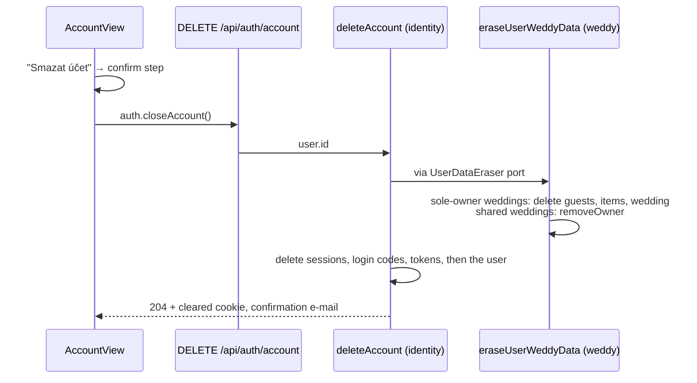

# Personal data (GDPR)

> The website collects personal data only under a published **privacy policy**
> (`/ochrana-osobnich-udaju`) and **terms** (`/obchodni-podminky`). Users delete
> their account themselves in account settings; contact messages expire after a
> year (Cosmos DB TTL) and accounts inactive for a year are deleted by a daily
> scheduler after an e-mail warning. A switch, `PERSONAL_DATA_COLLECTION_ENABLED`
> (currently **`true`**), can turn all collection off again on both sides.

## What collects personal data

| Feature | Personal data | Stored in | Retention | Code |
|---|---|---|---|---|
| Contact form | name, e-mail, message, IP | `contactMessages`, `rateLimits`, e-mail to the Gmail inbox | message **365 days** (container TTL); IP ≤ 24 h; inbox copy deleted manually within a year | `ContactSection.vue`, `submitContactMessage` |
| Registration | name, e-mail, **terms version + acceptance time**, IP | `users`, `tokens`, `rateLimits` | until the account is deleted | `RegisterView.vue`, `register` |
| Login and session | e-mail, IP, hashes of links/codes/sessions, `lastSeenAt` | `loginCodes`, `sessions`, `tokens`, `users` | code 1 h, link 30 days, session record 60 days, counters ≤ 24 h | `LoginView.vue`, `requestLoginCode`, `verifyLoginCode` |
| Account | name, e-mail, verification, last activity, UI language (`locale`) | `users` | until deletion; **inactive 365 days → deleted** (warning 30 days before) | `AccountView.vue`, `getCurrentUser` |
| IziWeddy | couple: name, birth year, e-mail, phone, note; guests (**third parties**): name, side, age group, status, family, note; items: name, URL, price, status | `weddings`, `guests`, `planningItems` | until the wedding or the account is deleted | `apps/portal/src/weddy`, `/api/weddy/*` |
| System e-mails | recipient address, content | Gmail sent mail | manual, within a year | `application/identity/emails.ts` |
| Session cookie | `fc_session` – random token | browser | 30 days or logout | `http/cookies.ts` |
| Language choice | `localStorage.fc_locale` – `cs`/`en`, never sent to the server | browser | until site data is cleared | `i18n/index.ts` |

Not collected: analytics, tracking, third-party embeds, fonts from a CDN – so no cookie banner is needed
(the only cookie is technically necessary).

## Legal documents

| Document | Route | Content source | Version constant |
|---|---|---|---|
| Zásady ochrany osobních údajů (Privacy policy) | `/ochrana-osobnich-udaju` | `privacyPolicy` in `apps/portal/src/content/legal.ts` | `PRIVACY_POLICY_VERSION` |
| Obchodní podmínky (Terms) | `/obchodni-podminky` | `termsOfService` in the same file | `TERMS_VERSION` |

- Rendered by `views/LegalView.vue` (table of contents, tables become cards on mobile).
  Linked from the footer, the registration form and the contact form notice.
- **Controller:** Libor Fridrich, sole trader, IČO 08005788, Nová 182, 273 51 Velké Přítočno,
  not a VAT payer (from ARES; held in `site` in `content/site.ts`). Name and IČO are also in the footer; the address only in the legal documents.
- **Processors named:** Microsoft Ireland Operations Ltd. (Azure hosting + Cosmos DB),
  Google Ireland Ltd. (Gmail); transfers outside the EEA via the EU-U.S. Data Privacy Framework / SCCs.
- **Legal bases:** contract (Art. 6(1)(b)) for the account, IziWeddy and replying to an enquiry;
  legitimate interest (Art. 6(1)(f)) for IP rate limits and the record of terms acceptance.
  Consent is not used – hence no consent checkbox on the contact form, only an information notice.
- **Retention values come from the shared kernel** (`CONTACT_MESSAGE_RETENTION_DAYS`,
  `INACTIVE_ACCOUNT_RETENTION_DAYS`, `INACTIVE_ACCOUNT_WARNING_DAYS`), which the API uses too –
  the documents cannot promise a period the code does not enforce.

> ⚠️ The documents are a template written by the agent from the actual code and
> data flows, **not legal advice**. A lawyer's review is recommended before relying on them.

## Terms acceptance at registration

- `RegisterRequest.acceptTerms` = `AcceptTermsSchema` (`v.literal(true)`) on FE and BE;
  unchecked → field error `acceptTerms` before sending.
- `User.register` refuses `acceptTerms: false` (domain invariant) and stores
  `termsVersion` + `termsAcceptedAt`. Neither is sent to the browser (`User.toPublic`).
- Changing the terms: bump `TERMS_VERSION`, e-mail users at least 14 days ahead (promised in the terms).

## Account deletion (right to erasure)

**Why a port and not a direct call:** domains must not call each other
(CLAUDE.md rule 3). Identity defines `UserDataEraser`; each product implements
it in its application layer; only `infrastructure/container.ts` wires them
(`userDataErasers: [...]`). A new product storing user data adds one line there.

**Why the user is deleted last:** Cosmos DB has no cross-container transactions.
If deletion fails halfway, the account still exists and deletion can be repeated;
the reverse order would leave product data with an owner that no longer exists.

## Retention scheduler

| Data | Mechanism | Why |
|---|---|---|
| Contact messages | Container `defaultTtl` = 365 days | Cosmos deletes by itself, no job to fail. `initDatabase` reconciles TTL on an existing container (`createIfNotExists` never changes it), and Cosmos then also removes older documents. |
| Inactive accounts | `.github/workflows/data-retention.yml` daily 03:17 UTC → `POST /api/maintenance/account-retention` | Deleting an account cascades into products (erasers), which TTL cannot do. SWA Free managed functions support HTTP triggers only, so the timer lives in GitHub Actions. |

Account retention rules (`applyAccountRetention`, `User.isDueForDeletion`):

1. Activity = `lastSeenAt`, updated at login and at most once a day while a session is used;
   accounts from before tracking fall back to `createdAt`.
2. Inactive ≥ 335 days and not warned → **warning e-mail**, `inactivityWarningSentAt` set.
3. Inactive ≥ 365 days **and** warned ≥ 30 days ago → **delete** (as above) + confirmation e-mail.
   An account is never deleted without a full 30-day warning, even if the scheduler did not run.
4. Any activity clears the warning and restarts the period.
5. At most 50 accounts per run (SWA functions time out after 45 s); the query skips
   recently warned accounts so they cannot block the batch.

The endpoint has `access: 'maintenance'`: header `x-maintenance-token` compared
with the `MAINTENANCE_TOKEN` setting (SHA-256 + `timingSafeEqual`); no setting → every call `401`.
It is registered even when the switch is off, because retention must keep deleting.

> ⚠️ **Setup required once:** generate a random token (e.g. `openssl rand -hex 32`),
> store it as Application setting `MAINTENANCE_TOKEN` in the Static Web App **and**
> as repository secret `MAINTENANCE_TOKEN` in GitHub. GitHub disables scheduled
> workflows after 60 days without repository activity – re-enable it in the Actions tab if that happens.

## The switch

`PERSONAL_DATA_COLLECTION_ENABLED` in `packages/shared/src/privacy.ts`:

| | `true` (now) | `false` |
|---|---|---|
| API | all endpoints | only `logout` and `applyAccountRetention` |
| Portal | forms, login, account, IziWeddy | routes in `personalDataRoutes` → 404; contact = `mailto:` only |
| Legal pages | shown | shown (they describe data already stored) |

Rules:

- **Every new feature that takes personal data** must be behind the switch – routes in
  `personalDataRoutes`, endpoints in `personalDataEndpoints`, links and buttons with `v-if` –
  **and** must be added to the privacy policy (table in section 2) with a bumped version.
- A product that stores user data must implement a `UserDataEraser` and register it in `container.ts`.
- No analytics, tracking pixels, third-party embeds or non-essential cookies without updating
  the policy (and adding a consent mechanism).

## Open items

- Gmail copies (contact messages, system e-mails) are deleted **manually** within a year – nothing automates it.
- No data export endpoint; portability requests are handled by e-mail (as the policy says).

## Related

- [identity](../domains/identity.md) · [contact](../domains/contact.md) · [weddy](../domains/weddy.md) · [Portal](../domains/portal.md)
- [Endpoints](endpoints.md) · [Data in Cosmos DB](dataCosmos.md) · [Deployment](../operations/deployment.md) · [Decisions](../decisions.md)
