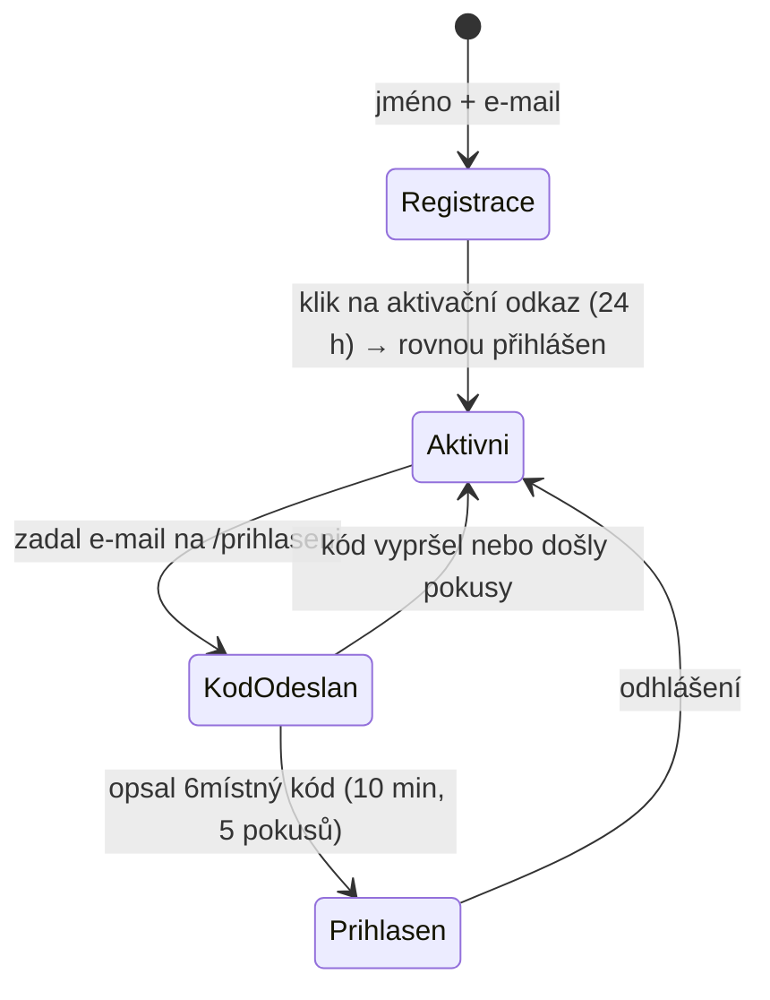

# Doména `identity`

> Vlastní účet na fridrich.cloud, **bez hesel**. Registrace jménem a e-mailem,
> aktivace odkazem, přihlášení šestimístným kódem ze schránky, session
> v httpOnly cookie. Jeden účet pro portál i všechny produkty.

## Rozhodnutí

- ✅ **Identita je vlastní modul API**, ne Microsoft Entra External ID –
  cizí přihlašovací obrazovka by nešla sladit se vzhledem portálu.
- ✅ **Bez hesel.** Totožnost prokazuje přístup do schránky. Odpadá hashování,
  politika hesel, obnova i credential stuffing. Cena: bezpečnost účtu = bezpečnost
  schránky a výpadek pošty = výpadek přihlašování.

## Toky

Úspěšné přihlášení kódem zároveň ověří e-mail – účet jde aktivovat i bez
kliknutí na odkaz.

## Doménový model (`apps/api/src/domain/identity`)

| Objekt | Odpovědnost |
|---|---|
| `User` | Agregát – e-mail, jméno, stav ověření. `register`, `verifyEmail`, `rename`, `changeEmail` (vynuluje ověření), `toPublic`. Jméno validuje přes `DisplayNameSchema`. |
| `EmailAddress` | Hodnotový objekt – normalizace na lowercase a tvar přes `AccountEmailSchema`. |
| `OneTimeToken` | Aktivační odkaz – expirace 24 h, jednorázovost (`consume`). |
| `LoginCode` | Přihlašovací výzva – platnost 10 min, max. 5 pokusů, jediná cesta dovnitř přes `verify()`. |
| `Session` | Přihlášení na 30 dní, posouvá se při aktivitě nejvýš jednou denně (`touch`). |
| `ports.ts` | `UserRepository`, `TokenRepository`, `LoginCodeRepository`, `SessionRepository`, `TokenGenerator`, `IdGenerator`, `RateLimiter` |
| `EmailSender` | Port pro odesílání e-mailů |

Use-casy (`application/identity`): `registerUser`, `verifyEmail`,
`requestLoginCode`, `verifyLoginCode`, `resolveSession`, `logout`; texty
e-mailů v `emails.ts`.

## Endpointy

| Endpoint | Metoda a cesta | Request → Response |
|---|---|---|
| `register` | `POST /api/auth/register` | `{ email, displayName }` → `202 { message }` – stejná i pro obsazený e-mail |
| `verifyEmail` | `POST /api/auth/verify-email` | `{ token }` → `200 User` + session cookie |
| `requestLoginCode` | `POST /api/auth/login` | `{ email }` → `202 { message }` – stejná i pro neznámou adresu |
| `verifyLoginCode` | `POST /api/auth/login/verify` | `{ email, code }` → `200 User` + session cookie |
| `logout` | `POST /api/auth/logout` | → `204`, smaže cookie |
| `getCurrentUser` | `GET /api/auth/me` | → `200 User`, `401` bez přihlášení |

Soubory: `apps/api/src/endpoints/identity/*.endpoint.ts`,
`apps/portal/src/identity/endpoints/*.endpoint.ts`. `User` =
`UserSchema` z `@fridrich/shared` (bez čehokoli z bezpečnostní vrstvy).

## Frontend

- `auth.store.ts` – `user`, `isAuthenticated`, `load()` (sdílí souběžná volání),
  `signInWithCode`, `activateAccount`, `signOut`.
- `RegisterView` a první krok `LoginView` volají endpointy přímo (stav nemění).
- `LoginView` pouští návrat (`redirect`) jen na stejný origin – ochrana proti open redirectu.

## Bezpečnostní pravidla

- **Kód platí 10 minut a přežije 5 chybných pokusů.** Obranou je okno
  a počítadlo, ne délka kódu. Počítadlo se ukládá i při neúspěchu.
- **Nový kód zneplatní předchozí.**
- **Kód chodí jen jako číslo k opsání, ne odkaz** – odkazy proklikávají
  skenery pošty.
- **V databázi jen otisky.** Tokeny SHA-256; kód hashovaný s `id` výzvy.
- **Odpovědi `/register` a `/login` neprozradí, zda e-mail existuje.**
  Chyba ověření kódu je stejná pro neznámý účet, neplatnou adresu i špatný kód –
  proto má `verifyLoginCode` schválně volné schéma.
- **Rate limiting** na registraci (5/h na IP), vyžádání kódu (20/h na IP
  **a** 5/h na adresu) a ověření kódu (20/15 min na IP). Limity žijí
  v Cosmos DB (`rateLimits`), aby platily napříč instancemi.
- **Adresa klienta** z `x-azure-clientip`, jinak **poslední** položka
  `x-forwarded-for` (první si posílá klient sám).
- **Session cookie** `fc_session`: `HttpOnly`, `SameSite=Lax`, `Path=/`,
  `Secure` v produkci, bez `Domain` (jeden origin). Nese náhodný token, ne data.
- **Ověření session je v obálce endpointu** (`access: 'user'`), ne v handlerech.
- Do logu nikdy token, kód ani obsah cookie.

## Související

- [Backend](../architektura/backend.md) · [Endpointy](../architektura/endpointy.md)
- [Data v Cosmos DB](../architektura/data-cosmos.md) – kontejnery a TTL
- [Lokální vývoj](../provoz/lokalni-vyvoj.md) – e-maily do konzole, rate limit při vývoji
