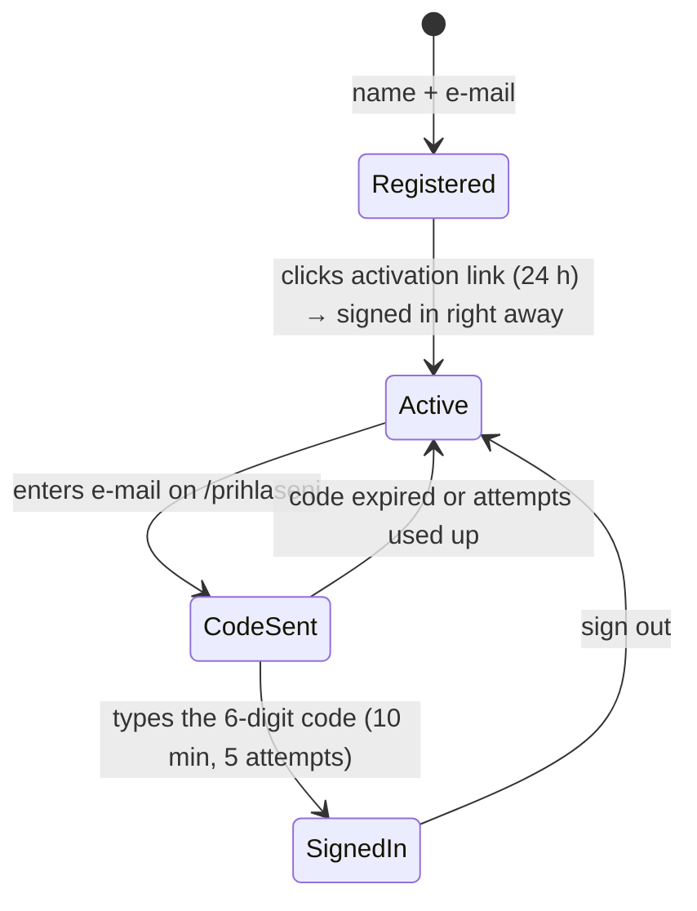

# `identity` domain

> An own account on fridrich.cloud, **without passwords**. Registration with a
> name and e-mail, activation via a link, login with a six-digit code from the
> mailbox, session in an httpOnly cookie. One account for the portal and all products.

> ℹ️ Registration requires accepting the terms; users delete their account in
> settings and inactive accounts are deleted after a year – see [personalData.md](../architecture/personalData.md).

## Decisions

- ✅ **Identity is our own API module**, not Microsoft Entra External ID – a
  third-party login screen could not match the portal look.
- ✅ **No passwords.** Identity is proven by access to the mailbox. No hashing,
  password policy, recovery or credential stuffing. The price: account security
  = mailbox security, and a mail outage = a login outage.

## Flows

A successful login with a code also verifies the e-mail – an account can be
activated without clicking the link.

## Domain model (`apps/api/src/domain/identity`)

| Object | Responsibility |
|---|---|
| `User` | Aggregate – e-mail, name, verification state, **terms version + acceptance time**, **`lastSeenAt`**, `inactivityWarningSentAt`. `register` (refuses without `acceptTerms`), `verifyEmail`, `rename`, `changeEmail` (resets verification), `markSeen` (at most one write a day, clears the warning), `isDueForDeletion`, `toPublic` (profile only). Validates the name via `DisplayNameSchema`. |
| `EmailAddress` | Value object – lowercase normalisation and shape via `AccountEmailSchema`. |
| `OneTimeToken` | Activation link – 24 h expiry, single use (`consume`). |
| `LoginCode` | Login challenge – valid 10 min, max. 5 attempts, the only way in is `verify()`. |
| `Session` | Sign-in for 30 days, extended on activity at most once a day (`touch`). |
| `ports.ts` | `UserRepository` (incl. `listForRetention`, `delete`), `TokenRepository`, `LoginCodeRepository`, `SessionRepository`, `TokenGenerator`, `IdGenerator`, `RateLimiter`, **`UserDataEraser`** (products delete their data about a user; wired in `container.ts`) |
| `EmailSender` | Port for sending e-mails |

**Language:** `User.locale` (cs/en) is set at registration and updated by `startSession` /
`resolveSession` from the request's `Accept-Language`; every e-mail exists in both
languages ([i18n.md](../architecture/i18n.md)).

Use cases (`application/identity`): `registerUser`, `verifyEmail`,
`requestLoginCode`, `verifyLoginCode`, `resolveSession`, `logout`,
`deleteAccount` and `applyAccountRetention` (`account.ts`); e-mail texts in
`emails.ts` (incl. inactivity warning and deletion confirmation). Login and
session use update `lastSeenAt`.

## Endpoints

| Endpoint | Method and path | Request → Response |
|---|---|---|
| `register` | `POST /api/auth/register` | `{ email, displayName, acceptTerms: true }` → `202 { message: key }` – identical for an already used e-mail |
| `verifyEmail` | `POST /api/auth/verify-email` | `{ token }` → `200 User` + session cookie |
| `requestLoginCode` | `POST /api/auth/login` | `{ email }` → `202 { message }` – identical for an unknown address |
| `verifyLoginCode` | `POST /api/auth/login/verify` | `{ email, code }` → `200 User` + session cookie |
| `logout` | `POST /api/auth/logout` | → `204`, clears the cookie |
| `getCurrentUser` | `GET /api/auth/me` | → `200 User`, `401` when signed out |
| `deleteAccount` | `DELETE /api/auth/account` | → `204`, clears the cookie; deletes product data (erasers), sessions, codes, tokens, then the user; confirmation e-mail |
| `applyAccountRetention` | `POST /api/maintenance/account-retention` | `access: 'maintenance'` → `200 { warned, deleted }`; called daily by the scheduler |

Files: `apps/api/src/endpoints/identity/*.endpoint.ts`,
`apps/portal/src/identity/endpoints/*.endpoint.ts`. `User` = `UserSchema` from
`@fridrich/shared` (nothing from the security layer).

## Frontend

- `auth.store.ts` – `user`, `isAuthenticated`, `load()` (concurrent calls share one request),
  `signInWithCode`, `activateAccount`, `signOut`, `closeAccount` (→ `deleteAccount`; on error the user stays signed in).
- `RegisterView` has the terms checkbox and links to both legal documents; `AccountView` has the
  *Smazat účet* (Delete account) section with a confirmation step and a final "account deleted" state.
- `RegisterView` and the first step of `LoginView` call endpoints directly (no state change).
- `LoginView` allows the return target (`redirect`) only on the same origin – protection against open redirects.

## Security rules

- **A code is valid for 10 minutes and survives 5 wrong attempts.** The defence
  is the window and the counter, not the code length. The counter is saved even on failure.
- **A new code invalidates the previous one.**
- **The code is sent only as a number to type, not a link** – links get clicked by mail scanners.
- **Only hashes in the database.** Tokens SHA-256; the code is hashed together with the challenge `id`.
- **`/register` and `/login` responses never reveal whether an e-mail exists.**
  The code verification error is identical for an unknown account, an invalid
  address and a wrong code – that is why `verifyLoginCode` has a deliberately loose schema.
- **Rate limiting** on registration (5/h per IP), code request (20/h per IP
  **and** 5/h per address) and code verification (20/15 min per IP). Limits
  live in Cosmos DB (`rateLimits`) so they apply across instances.
- **Client address** from `x-azure-clientip`, otherwise the **last** entry of
  `x-forwarded-for` (the first one is set by the client).
- **Session cookie** `fc_session`: `HttpOnly`, `SameSite=Lax`, `Path=/`,
  `Secure` in production, no `Domain` (single origin). Carries a random token, not data.
- **Session verification is in the endpoint wrapper** (`access: 'user'`), not in handlers.
- Never log a token, code or cookie content.

## Related

- [Backend](../architecture/backend.md) · [Endpoints](../architecture/endpoints.md)
- [Data in Cosmos DB](../architecture/dataCosmos.md) – containers and TTL
- [Local development](../operations/localDevelopment.md) – e-mails to the console, rate limit during development
