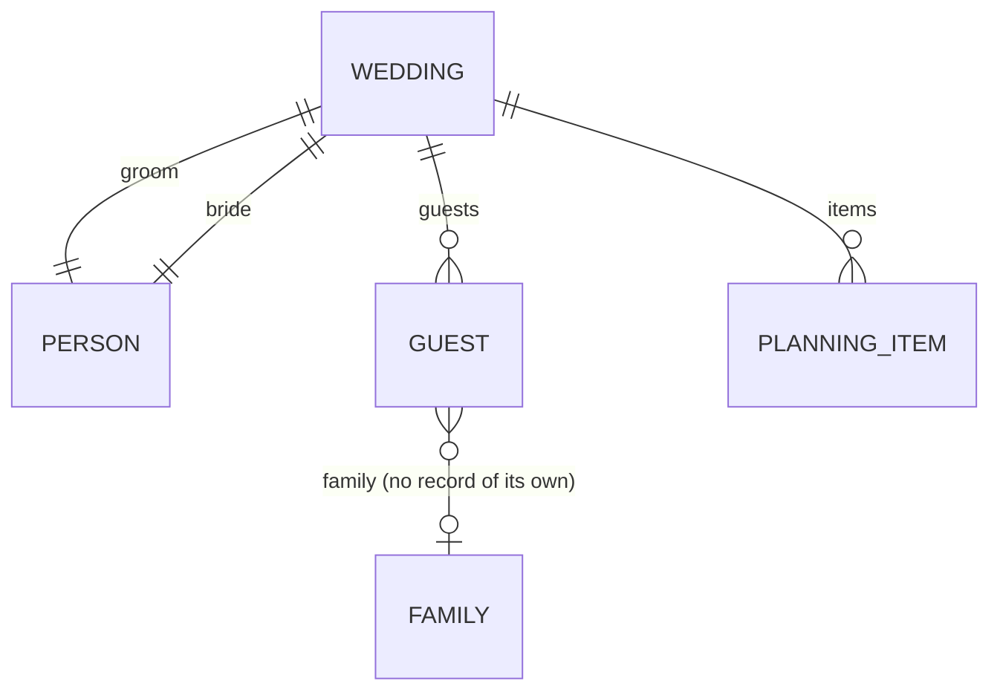

# `weddy` domain – IziWeddy, the wedding planner

> A mobile web application for planning a wedding: the couple, guests (including
> whole families), preparation sections with vendor items and an automatically
> calculated budget. Runs under the portal at `www.fridrich.cloud/izi-weddy`
> with the shared fridrich.cloud account.

| | |
|---|---|
| **Address** | `/izi-weddy` (constant `WEDDY_BASE`) |
| **API** | `/api/weddy/*` |
| **Frontend** | `apps/portal/src/weddy` |
| **Shared kernel** | `packages/weddy-shared` |
| **Currency** | CZK |
| **Platform** | mobile-first, works on desktop too |
| **Status** | ✅ done; stores personal data of the couple and guests under the privacy policy – data deleted with the wedding or the account ([personalData.md](../architecture/personalData.md)) |
| **UI language** | Czech and English (switcher in the dashboard and wedding headers) – [i18n.md](../architecture/i18n.md) |

## Subdomains

| Subdomain | Content | Page |
|---|---|---|
| `wedding` | The plan as a whole: title, date, couple, owners, access; dashboard | [weddyWedding.md](weddyWedding.md) |
| `guests` | Guests, families, filters, sorting, statistics | [weddyGuests.md](weddyGuests.md) |
| `planning` | 11 preparation sections and their items | [weddyPlanning.md](weddyPlanning.md) |
| `budget` | Budget from all items | [weddyBudget.md](weddyBudget.md) |

**Access:** every wedding has `ownerIds`. All use cases of all subdomains start
with `loadWeddingFor(deps, weddingId, userId)` – a missing wedding is `404`,
someone else's `403`. Endpoints do not write this check.

## Routes

Relative to `/izi-weddy`; links are built with `weddyPath()`.

| Route | Screen | Subdomain |
|---|---|---|
| `/` | Dashboard | wedding |
| `/weddings/new` | New plan | wedding |
| `/weddings/:weddingId` | → redirect to `couple` | wedding |
| `/weddings/:weddingId/couple` | Couple | wedding |
| `/weddings/:weddingId/guests` | Guests | guests |
| `/weddings/:weddingId/planning` | Section overview | planning |
| `/weddings/:weddingId/planning/:category` | Section detail | planning |
| `/weddings/:weddingId/budget` | Budget | budget |

The wedding detail (`WeddingLayout`) has a top bar with the title and a **bottom
navigation** with four tabs: 💑 Snoubenci (Couple) · 👥 Hosté (Guests) ·
📋 Plánování (Planning) · 💰 Rozpočet (Budget).

## UI principles (mobile-first)

- Design starts at **360 px** width; tablet and notebook layouts via the shared
  breakpoints `--tablet` (768 px) / `--notebook` (1024 px) – see [frontend.md](../architecture/frontend.md#responsive-layout-and-breakpoints).
- Touch targets at least **44 × 44 px**.
- Primary action as a **floating action button (FAB)** bottom right.
- Forms as a **bottom sheet** (`BottomSheet.vue`) or full screen.
- Status always shown by **colour and text** (`StatusBadge.vue`, `kind="guest" | "planning"` – both have `accepted` with different labels).
- Numeric fields use `inputmode="numeric"`.
- Product styles only under the `.weddy` class – see [frontend.md](../architecture/frontend.md#routing-and-product-look).

## Open questions and extensions

Open questions are in [decisions.md](../decisions.md#open-questions).
Possible extensions from the brief: budget target, deposits and payments, task
checklist with deadlines, seating plan, dietary restrictions, CSV export, guest
reminders, dark mode.

## Related

- [Domain architecture](../architecture/domains.md)
- Source: [raw/iziweddySpec.md](../../raw/iziweddySpec.md)
