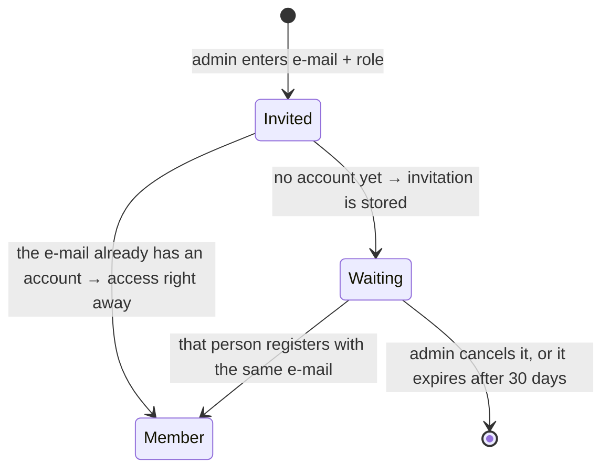

# `weddy / access` – roles and invitations

> Who sees a wedding plan and what they may do with it. The creator is the
> **admin**; they can invite others by e-mail as **manager** (edits everything
> except the settings) or **viewer** (read only). An invitation to an address
> without an account waits until that person registers.

## Roles

| Role | Content (couple, guests, planning) | Settings, access, deletion | Who gets it |
|---|---|---|---|
| `admin` | ✅ | ✅ | the person who created the plan; exactly one per plan |
| `manager` | ✅ | ❌ | invited by the admin |
| `viewer` | ❌ read only | ❌ | invited by the admin |

- The role is a property of the pair user–plan, not of the account: the same
  person can be an admin of their own plan and a viewer of someone else's.
- **The admin role cannot be granted, changed or removed** – it belongs to the
  creator. Handing a plan over is [open question 15](../decisions.md#open-questions).
- Helpers `canEditWedding(role)` and `canManageWeddingSettings(role)` live in the
  shared kernel, so the frontend hides exactly what the API refuses.

## Where access is enforced

The aggregate decides, not the endpoint:

```ts
loadWeddingFor(deps, weddingId, userId, 'read' | 'edit' | 'settings')
  → wedding.assertCanRead / assertCanEdit / assertCanManageSettings
```

Every use case of every weddy subdomain starts with it, so a forgotten check in
one endpoint cannot open a plan. Reading (`listGuests`, `getBudget`, …) needs
`read`, anything that writes needs `edit`, and the settings and access endpoints
need `settings`. A missing plan is `404`, a foreign one `403`.

The frontend only hides controls (`wedding.store` exposes `canEdit` and
`canManageSettings`); it is a courtesy, never the protection.

## Inviting



- The invited person with an account is added immediately and gets an
  informational e-mail; the one without an account gets an invitation e-mail
  with a link to registration. The e-mail is in the language of the admin's
  request – the invited person has no account yet, so no stored language.
- The invitation e-mail carries **no link into the plan** and no plan id; access
  only ever follows from an account.
- One waiting invitation per e-mail and plan (`alreadyInvited`), an existing
  member cannot be invited again (`alreadyMember`), and inviting yourself is
  refused.
- `claimWeddingInvitations` runs on registration through the identity port
  `UserRegistrationListener` – domains still do not call each other
  ([domains.md](../architecture/domains.md#dependency-rules)). An expired
  invitation grants nothing and is only cleaned up.
- Names and e-mails of members come from the `UserDirectory` port, implemented
  over the identity repository in `infrastructure/cosmos`.

## Endpoints

All of them require `settings` access, so only the admin can call them. Every
response is the whole access list, so the screen never recomputes it.

| Endpoint | Method and path | Request → Response |
|---|---|---|
| `listWeddingAccess` | `GET …/access` | → `{ members, invitations }` |
| `inviteToWedding` | `POST …/access` | `{ email, role }` → `201 { members, invitations }` |
| `changeWeddingMemberRole` | `PATCH …/access/{memberId}` | `{ role }` → `{ members, invitations }` |
| `removeWeddingMember` | `DELETE …/access/{memberId}` | → `{ members, invitations }` |
| `cancelWeddingInvitation` | `DELETE …/invitations/{invitationId}` | → `{ members, invitations }` |

Prefix `…` = `/api/weddy/weddings/{weddingId}`. `role` accepts only `manager`
and `viewer` (`InvitableRoleSchema`).

## Personal data

The e-mail of an invited person is personal data of someone who may not even be
a user. It is therefore stored only in the invitation, deleted when the
invitation is accepted or cancelled, and otherwise removed by the container TTL
after 30 days (`WEDDING_INVITATION_RETENTION_DAYS`). Deleting an account also
deletes invitations addressed to its e-mail. The privacy policy describes it –
[personalData.md](../architecture/personalData.md).

## Code

| Layer | File |
|---|---|
| Shared kernel | `packages/weddy-shared/src/wedding.ts` – `WeddingRoleSchema`, `InvitableRoleSchema`, `WeddingMemberSchema`, `WeddingInvitationSchema`, `WeddingAccessSchema`, `InviteToWeddingInputSchema`, `canEditWedding`, `canManageWeddingSettings` |
| Domain | `apps/api/src/domain/weddy/wedding/Wedding.ts` (members, `assertCan*`, `addMember`, `changeMemberRole`, `removeMember`, `leave`), `WeddingInvitation.ts`, `WeddingInvitationRepository.ts`, `UserDirectory.ts` |
| Use cases | `apps/api/src/application/weddy/access.ts`; e-mail texts in `application/weddy/emails.ts` |
| Endpoints | `apps/api/src/endpoints/weddy/access/`, `apps/portal/src/weddy/access/endpoints/` |
| UI | `apps/portal/src/weddy/wedding/SettingsView.vue` (block *Access*) |
| Storage | container `weddingInvitations`, PK `/weddingId`, TTL 30 days; members are part of the wedding document |
| Tests | `apps/api/test/weddyAccess.test.ts` |

## Related

- [weddy / wedding](weddyWedding.md) – the settings screen, title and date
- [weddy](weddy.md) · [identity](identity.md) · [personal data](../architecture/personalData.md)
